# 🧠 SynapseAudit - AI-Powered Security Code Analysis


<p align="center">
  <a href="https://github.com/digidenone/SynapseAudit/releases">
    
  </a>
  <a href="https://github.com/digidenone/SynapseAudit/blob/main/LICENSE">
    
  </a>
  
  
  
  
</p>

<p align="center">
  <strong>🔐 Professional-grade security analysis for your code, powered by AI</strong><br>
  <em>Works like Copilot - seamless, intelligent, and instant</em>
</p>

---

## 🌟 Where to Find SynapseAudit

SynapseAudit is available and featured across multiple platforms:

- **[🌐 Official Website](https://synapseaudit.vercel.app/)** - Complete documentation and live demos
- **[📦 VS Code Marketplace](https://marketplace.visualstudio.com/items?itemName=Digidenone.synapse-audit)** - Install directly from VS Code
- **[🚀 Product Hunt](https://www.producthunt.com/products/synapseaudit)** - Featured AI security tool
- **[👥 Peerlist](https://peerlist.io/chiragnahata/project/synapseaudit)** - Community showcase and project details
- **[🐙 GitHub](https://github.com/digidenone/SynapseAudit)** - Open source repository

---

## 🚀 **Ready to Use - GitHub Authentication Required!**

**SynapseAudit is a complete VS Code extension that works out of the box.** Simply install, authenticate with GitHub, and start analyzing your code for security vulnerabilities!

### ⚡ **Quick Install & Use**

1. **Install Extension**: Download [`synapse-audit-1.5.0.vsix`](https://github.com/digidenone/SynapseAudit/releases/latest)
2. **In VS Code**: `Ctrl+Shift+P` → "Extensions: Install from VSIX" → Select the file
3. **🔐 Authenticate**: Extension will prompt for GitHub sign-in (uses VS Code's built-in authentication)
4. **Start Backend**: `Ctrl+Shift+P` → "SynapseAudit: Start Backend Server"
5. **Analyze Code**: Press `Ctrl+Shift+S` in any code file → Get instant security insights!

**🔐 Authentication Benefits:**
- Secure access to AI-powered analysis
- GitHub integration for issue creation
- Personalized security recommendations
- Activity tracking and audit logs

### 🐙 **GitHub Integration Features**

With GitHub authentication, you get:

- **🔐 Secure Authentication**: Uses VS Code's built-in GitHub provider
- **🎯 Issue Creation**: Create GitHub issues directly from security findings
- **📋 Security Advisories**: Generate and publish security advisories
- **🔄 CI/CD Integration**: Add security workflows to your repositories

## ✨ **What You Get**

**SynapseAudit** - seamlessly integrated into your VS Code workflow with intelligent, real-time feedback.

### 🔍 **Security Analysis**
- **🚨 SQL Injection Detection**: Identifies dangerous database queries
- **🚨 XSS Prevention**: Detects cross-site scripting vulnerabilities  
- **🚨 Secret Detection**: Finds hardcoded passwords, API keys, tokens
- **🚨 Input Validation**: Ensures proper data sanitization
- **🚨 Code Injection**: Identifies eval() and similar risks
- **🚨 Path Traversal**: Prevents file system vulnerabilities

### 🧠 **AI-Powered Intelligence**
- **Multi-LLM Support**: Integrated with OpenAI GPT-4, Google Gemini, Anthropic Claude, and local Ollama models
- **Auto-Generated Test Cases**: Automatically creates comprehensive security test cases for your code
- **Advanced AI Suggestions**: AI recommendations that go beyond simple pattern matching
- **Requirement Gap Analysis**: Compares code against your specifications
- **Smart Recommendations**: Context-aware improvement suggestions with implementation details
- **One-Click Fixes**: Apply suggested improvements instantly
- **Input Validation Detection**: Identifies missing or weak input validation patterns
- **Logging Analysis**: Suggests appropriate logging levels and security event tracking
- **Error Handling Enhancement**: Recommends comprehensive error handling strategies
- **Intelligent Fallback System**: Automatic provider switching with graceful degradation

### 🎯 **Developer Experience**
- **Comprehensive Desktop App**: Full-featured Electron desktop application with professional cyberpunk UI
- **Real-Time Analysis Interface**: Live code analysis with instant feedback and visual indicators
- **AI Assistant Chat**: Interactive AI-powered security assistant with context-aware responses
- **Advanced Testing Suite**: 50+ vulnerability detection categories with automated test generation
- **Multi-Platform Support**: Available as VS Code extension, desktop app, PWA, and web application
- **Responsive Design**: Modern, mobile-friendly interface that adapts to any screen size
- **Inline Decorations**: Visual indicators directly in your code (like spelling errors)
- **Sidebar Results**: Professional results panel with severity indicators
- **Keyboard Shortcuts**: `Ctrl+Shift+S` for instant analysis (customizable)
- **Context Menus**: Right-click any file to analyze
- **Auto-Analysis**: Optional analysis on file save
- **50+ Security Checks**: Comprehensive vulnerability detection across 8 attack categories
- **📊 Comprehensive Logging**: Detailed logs for debugging and monitoring
- **🧪 Test Generation**: Auto-generate comprehensive test cases for detected vulnerabilities
- **📋 Testing Infrastructure**: Built-in test runner with multiple test categories

### 🐙 **GitHub Integration**
- **🐛 Auto-Create Issues**: Convert vulnerabilities into GitHub issues with one click
- **🛡️ Security Advisories**: Generate comprehensive security advisory drafts
- **⚙️ CI/CD Workflows**: Auto-generate GitHub Actions security scanning workflows
- **📊 SARIF Integration**: Upload results to GitHub Security tab
- **🏷️ Smart Labeling**: Automatic tagging with security, vulnerability, automated labels
- **📈 Compliance Ready**: Follow GitHub security best practices

### 🚀 **Performance & Optimization**
- **⚡ Smart Caching**: Results cached for faster re-analysis
- **🔄 Debounced Analysis**: Prevents excessive API calls during rapid typing
- **🎯 Background Processing**: Non-blocking analysis for better UX
- **📊 Performance Metrics**: Track analysis speed and efficiency
- **🎛️ Configurable Limits**: Customize timeouts and batch sizes
- **🧠 Memory Management**: Efficient resource usage for large projects

### 🎨 **Advanced Customization**
- **🎨 Custom Color Schemes**: Personalize decoration colors and styles
- **🔧 Flexible AI Backend**: Multi-provider support (OpenAI, Google Gemini, Anthropic Claude, Ollama) with automatic fallback
- **📝 Custom Analysis Prompts**: Tailor AI analysis to your specific needs
- **🎯 Severity Filtering**: Show only critical, high, or all severity levels
- **📁 File Exclusion Patterns**: Skip analysis for specific files/folders
- **⚙️ Granular Settings**: 25+ configuration options for complete control
- **⌨️ Custom Keyboard Shortcuts**: Set your own key combinations for commands
- **🖥️ Multi-Platform Deployment**: Desktop app, web app, PWA, and Chrome extension
- **🔄 Real-Time Synchronization**: Seamless data sync across all platforms
- **🎭 Professional UI Themes**: Cyberpunk, modern, and classic interface options

### 🎨 **Visual Integration**
```javascript
// Example: Visual feedback in your code
function loginUser(username) {
    const query = "SELECT * FROM users WHERE name = '" + username + "'";
    //           ^^^^^^^^^^^^^^^^^^^^^^^^^^^^^^^^^^^^^^^^^^^^^^^^^^^^^^^^
    //           🚨 Red underline appears here - SQL Injection detected!
    //           Hover shows: "Use parameterized queries to prevent SQL injection"
    return database.execute(query);
}
```

**Results appear in sidebar:**
```
🚨 Critical Vulnerabilities (1)
├── SQL Injection (Line 2)
│   └── 🔧 Quick Fix: Use parameterized queries
│   └── 🧪 Generate Test: Add security test case

💡 AI Recommendations (3)
├── Add input validation for username
├── Implement proper error handling  
└── Add logging for security events
```

## 🎮 **How to Use SynapseAudit**

### **Method 1: Desktop Application (Recommended)**
1. Launch the SynapseAudit desktop app
2. Navigate to Dashboard and drag & drop your code files
3. View comprehensive results with interactive visualizations
4. Use the AI Assistant for context-aware security guidance
5. Generate and run security tests with one-click automation
6. Export professional security reports in multiple formats

### **Method 2: VS Code Extension**
1. Open any code file in VS Code
2. Press `Ctrl+Shift+S` (Windows/Linux) or `Cmd+Shift+S` (Mac)
3. View results in the SynapseAudit sidebar
4. Click 🔧 **Quick Fix** buttons to apply suggestions
5. Click 🧪 **Generate Test** to add security tests

### **Method 3: Web Application & PWA**
1. Access the web interface through your browser
2. Upload files or paste code for analysis
3. View responsive results on any device
4. Share security reports with your team
5. Install as PWA for offline functionality

### **Method 4: Command Palette (VS Code)**
1. Press `Ctrl+Shift+P` to open Command Palette
2. Type "SynapseAudit: Analyze Current File"
3. Optionally enter requirements/user story when prompted
4. Review results and apply fixes

### **Method 5: Context Menu**
1. Right-click on any file in Explorer or in the editor
2. Select "SynapseAudit: Analyze Current File"
3. View comprehensive security analysis

### **Available Commands**
- `SynapseAudit: Analyze Current File` - Analyze active file (`Ctrl+Shift+S` by default)
- `SynapseAudit: Analyze Workspace` - Scan entire project (`Ctrl+Shift+W` by default)
- `SynapseAudit: Generate Test Cases` - Auto-generate security test cases for current file
- `SynapseAudit: Generate AI Suggestions` - Get advanced AI-powered security recommendations
- `SynapseAudit: Clear Results` - Clear analysis results (`Ctrl+Shift+C` by default)
- `SynapseAudit: Export Report` - Generate security report in PDF/HTML/JSON formats
- `SynapseAudit: Start Backend Server` - Start analysis engine
- `SynapseAudit: Stop Backend Server` - Stop backend service
- `SynapseAudit: Show Output Logs` - View detailed logs for debugging
- `SynapseAudit: Show Welcome Guide` - Display welcome and help information
- `SynapseAudit: Open Desktop App` - Launch the standalone desktop application
- `SynapseAudit: Configure AI Provider` - Set up OpenAI, Gemini, Anthropic, or Ollama
- `SynapseAudit: Create GitHub Issue` - Convert vulnerabilities to GitHub issues
- `SynapseAudit: Generate Security Workflow` - Create CI/CD security automation

### **What You'll See**
```
� SynapseAudit Analysis Results

🚨 Critical Issues (2)
├── 🔴 SQL Injection (Line 15)
│   Description: Direct string concatenation in SQL query
│   Fix: Use parameterized queries with prepared statements
│   [🔧 Apply Fix] [🧪 Add Test] [ℹ️ More Info]
│
└── 🔴 Hardcoded Secret (Line 8)
    Description: API key exposed in source code
    Fix: Move to environment variables
    [🔧 Apply Fix] [🧪 Add Test] [ℹ️ More Info]

🟠 Medium Issues (3)
├── 🟠 XSS Vulnerability (Line 22)
└── 🟠 Missing Input Validation (Line 35)

💡 AI Recommendations (5)
├── Add comprehensive error handling
├── Implement request rate limiting
└── Add security headers for HTTP responses
```

## 🧪 **Testing Infrastructure**

SynapseAudit includes a comprehensive testing framework for validating security detection capabilities:

### **Built-in Test Suite**
```bash
# Run basic vulnerability detection tests (20+ test cases)
npm run test:simple

# Show testing guide and available options
npm run test:help

# Run tests in watch mode for development
npm run test:watch

# Run specific vulnerability tests
npm run test:vulnerabilities
```

### **Auto-Generated Test Cases**
The extension can automatically generate test cases for your code:

1. **Open a file** with potential security issues
2. **Run command**: `SynapseAudit: Generate Test Cases`
3. **Review generated tests** covering detected vulnerability patterns
4. **Run tests**: Use `npm run test:generated` to execute them

### **Test Categories Covered**
- 🔍 SQL Injection Detection
- 🚨 Cross-Site Scripting (XSS)
- 🔑 Hardcoded Secrets Detection
- 🔐 Weak Cryptography
- 💻 Command Injection
- 📁 Path Traversal
- 🧠 AI-Generated Security Patterns
- 🛡️ Advanced Vulnerability Patterns

### **Testing Documentation**
See our comprehensive [Testing Guide](TESTING.md) for detailed information on:
- Running different test suites
- Creating custom test cases
- Understanding test results
- Contributing new test patterns

## 🧪 **Complete Testing Workflow**

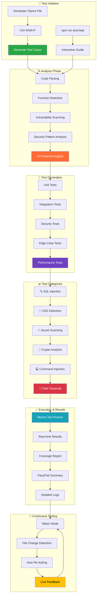

### **Test Suite Statistics**

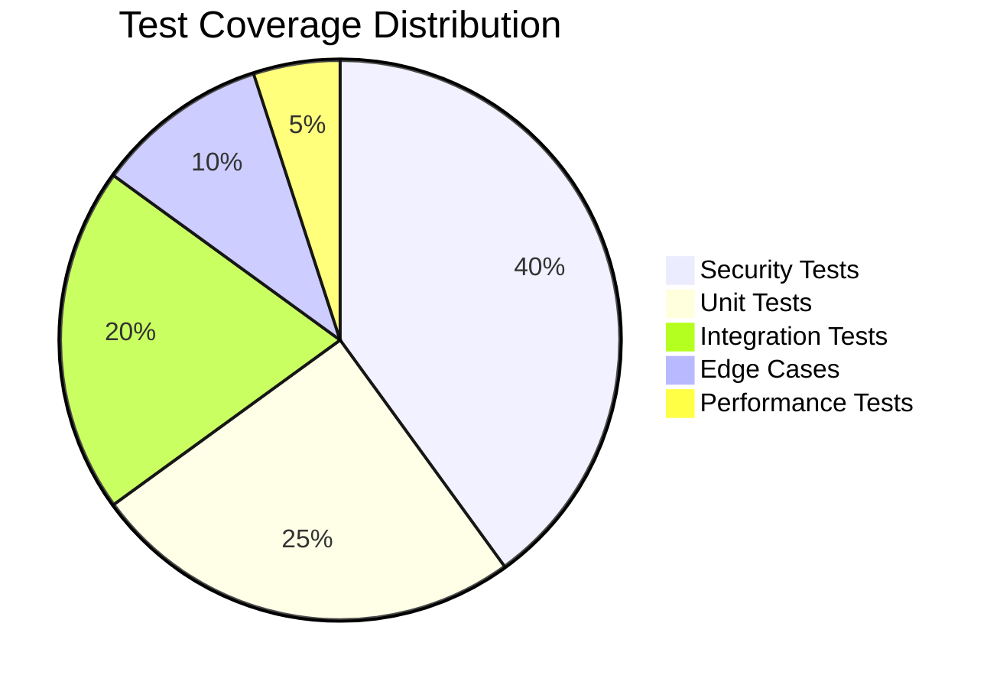

## 📁 **Complete Project Architecture**

```mermaid
graph TD
    subgraph "🏗️ SynapseAudit Extension"
        A[🏠 Root Directory] --> B[📦 package.json<br/>Extension Config]
        A --> C[📝 README.md<br/>Documentation]
        A --> D[🔧 tsconfig.json<br/>TypeScript Config]
        A --> E[🎯 .gitignore<br/>Git Exclusions]
        A --> F[📄 LICENSE<br/>MIT License]
    end
    
    subgraph "💻 Frontend (TypeScript)"
        G[📂 src/] --> H[🧩 extension.ts<br/>Main Extension Logic]
        G --> I[📊 sidebarWebview.ts<br/>UI Components]
        G --> J[🎨 decorationProvider.ts<br/>Visual Indicators]
        G --> K[📍 statusBarProvider.ts<br/>Status Updates]
        G --> L[🔍 plagiarismUtils.ts<br/>Analysis Utils]
    end
    
    subgraph "🐍 Backend (Python)"
        M[📂 backend/] --> N[🚀 start.py<br/>Server Entry]
        M --> O[🌐 app.py<br/>FastAPI Routes]
        M --> P[🔍 audit_engine.py<br/>Security Analysis]
        M --> Q[🤖 llm_providers.py<br/>AI Integration]
        M --> R[📊 plagiarism_engine.py<br/>Code Similarity]
        M --> S[⚙️ requirements.txt<br/>Dependencies]
    end
    
    subgraph "🧠 AI & Models"
        T[📂 models/] --> U[📋 request_schema.py<br/>API Schemas]
        T --> V[🔍 plagiarism_schema.py<br/>Detection Models]
        W[📂 prompts/] --> X[🎯 universal_prompt.txt<br/>AI Instructions]
    end
    
    subgraph "🧪 Testing & QA"
        Y[📂 demo/] --> Z[🧪 test-runner.js<br/>Test Executor]
        Y --> AA[📋 test-simple.js<br/>Basic Tests]
        Y --> BB[🛡️ test-vulnerabilities.js<br/>Security Tests]
        Y --> CC[📖 TESTING.md<br/>Test Documentation]
    end
    
    subgraph "📚 Documentation"
        DD[📂 docs/] --> EE[📖 README.md<br/>Main Guide]
        DD --> FF[🚀 QUICKSTART.md<br/>Getting Started]
        DD --> GG[⚙️ configuration.md<br/>Settings Guide]
        DD --> HH[🛠️ troubleshooting.md<br/>Problem Solving]
        DD --> II[🔧 ADVANCED_FEATURES.md<br/>AI Features]
        DD --> JJ[📋 extension_commands.md<br/>Command Reference]
    end
    
    subgraph "🎨 Media & Assets"
        KK[📂 media/] --> LL[🎨 styles.css<br/>UI Styling]
        KK --> MM[⚡ main.js<br/>Frontend Logic]
        KK --> NN[🏠 welcome.html<br/>Welcome Page]
    end
    
    A --> G
    A --> M
    M --> T
    M --> W
    A --> Y
    A --> DD
    A --> KK
    
    style A fill:#FF6B35,color:#fff
    style H fill:#28A745,color:#fff
    style N fill:#6F42C1,color:#fff
    style Z fill:#DC3545,color:#fff
    style EE fill:#FFC107,color:#000
```

## 🔄 **Development & Deployment Pipeline**

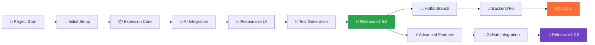

## 🏗️ **Project Structure**

```
SynapseAudit/
├── 📁 src/                          # VS Code Extension Source
│   ├── extension.ts                 # Main extension entry point
│   ├── sidebarWebview.ts           # Sidebar UI and results panel (responsive design)
│   ├── decorationProvider.ts       # Inline vulnerability indicators
│   ├── statusBarProvider.ts        # Status bar integration
│   └── plagiarismUtils.ts          # Security analysis utilities
├── 📁 backend/                      # Python Analysis Engine
│   ├── app.py                      # FastAPI server
│   ├── audit_engine.py             # Core security analysis
│   ├── llm_providers.py            # AI/LLM integrations
│   ├── models/                     # Data models
│   │   └── request_schema.py       # API request/response schemas
│   └── prompts/                    # AI prompt templates
│       └── universal_prompt.txt    # Security analysis prompts
├── 📁 media/                       # UI Assets
│   ├── welcome.html                # Welcome guide page
│   ├── main.js                     # Frontend JavaScript
│   └── styles.css                  # Responsive CSS styles
├── 📁 demo/                        # Example Files & Tests
│   ├── test-simple.js              # Simple test cases
│   ├── test-vulnerabilities.js     # Comprehensive vulnerability tests
│   └── TESTING_GUIDE.md           # Testing documentation
├── 📁 docs/                        # Documentation
│   ├── INSTALLATION_GUIDE.md       # Setup instructions
│   ├── QUICKSTART.md              # Getting started guide
│   ├── configuration.md           # Settings documentation
│   ├── ADVANCED_FEATURES.md       # Advanced functionality guide
│   └── troubleshooting.md         # Common issues
├── 📄 test-simple.js               # Main vulnerability test suite
├── 📄 test-runner.js               # Interactive test helper
├── 📄 TESTING.md                   # Comprehensive testing guide
├── 📄 .mocharc.json                # Test configuration
├── 📄 package.json                 # Extension manifest with test scripts
├── 📄 tsconfig.json                # TypeScript configuration
└── 📄 .gitignore                   # Git ignore patterns
```

## 🧩 **System Architecture**

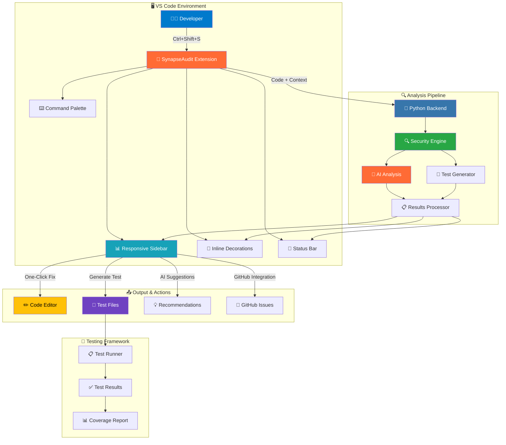

## 🔄 **Advanced Feature Integration Flow**

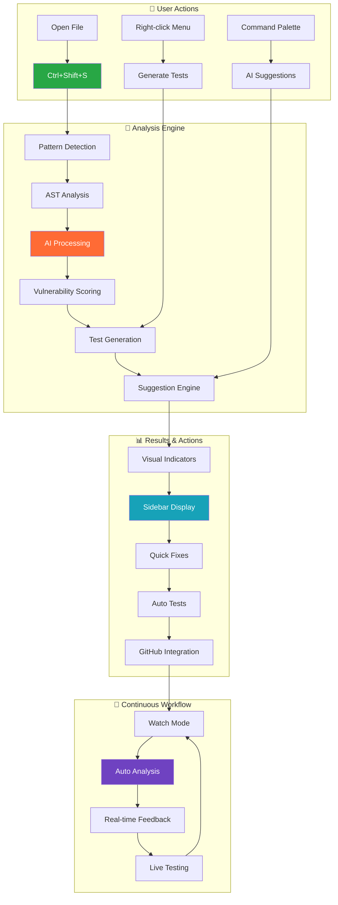

## 🧠 **Technical Architecture**

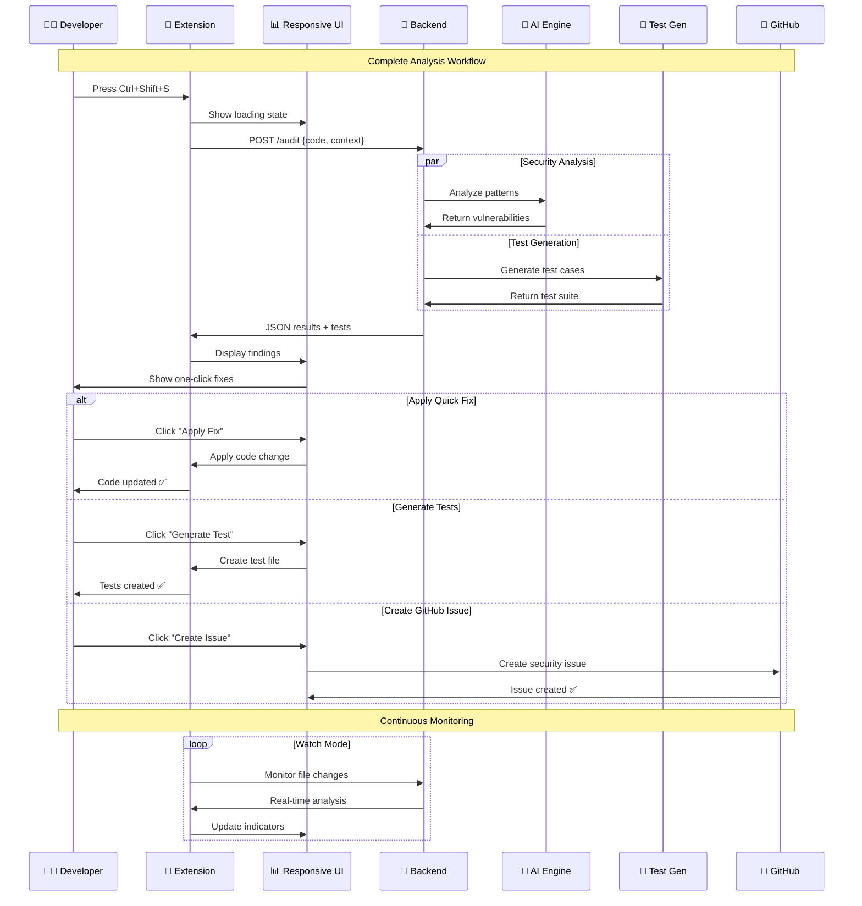

## 🏗️ **Project Structure**

```
🧠 SynapseAudit/
├── 📁 src/                              # 🎯 VS Code Extension Core
│   ├── 📄 extension.ts                  # 🚀 Main entry point (2300+ lines)
│   │   ├── 🔧 Command registrations    # All VS Code commands
│   │   ├── 🧠 AI suggestion engine     # Advanced recommendations
│   │   ├── 🧪 Test case generator      # Auto test creation
│   │   └── 🔄 Event handlers          # File/editor events
│   ├── 📄 sidebarWebview.ts           # 📱 Responsive UI (mobile-first)
│   │   ├── 🎨 Dynamic CSS generation   # Adaptive styling
│   │   ├── 📊 Results visualization    # Interactive charts
│   │   └── 🔧 Action buttons          # Quick fixes, tests
│   ├── 📄 decorationProvider.ts        # 🎨 Inline visual feedback
│   ├── 📄 statusBarProvider.ts         # 📍 Status bar integration
│   └── 📄 plagiarismUtils.ts          # 🔍 Security analysis utilities
├── 📁 backend/                          # 🐍 Python Analysis Engine
│   ├── 📄 app.py                       # 🌐 FastAPI server
│   ├── 📄 audit_engine.py              # 🔍 Core security analysis
│   ├── 📄 llm_providers.py            # 🤖 Multi-LLM support (OpenAI, Gemini, Anthropic, Ollama)
│   ├── 📄 plagiarism_engine.py         # 📊 Advanced pattern detection
│   ├── 📁 models/                      # 📋 Data structures
│   │   ├── 📄 request_schema.py        # API schemas
│   │   └── 📄 plagiarism_schema.py     # Analysis models
│   └── 📁 prompts/                     # 🧠 AI prompt engineering
│       └── 📄 universal_prompt.txt     # Security analysis prompts
├── 📁 desktop/                         # 🖥️ Electron Desktop Application
│   ├── 📄 main.js                      # Electron main process
│   ├── 📄 preload.js                   # IPC communication bridge
│   ├── 📄 package.json                 # Desktop app configuration
│   └── 📁 frontend-dist/               # Built frontend assets
├── 📁 frontend/                        # ⚛️ React Web Application
│   ├── 📄 package.json                 # Frontend dependencies
│   ├── 📄 vite.config.js               # Vite configuration
│   ├── 📁 src/                         # React source code
│   │   ├── 📄 App.jsx                  # Main application component
│   │   ├── 📁 components/              # Reusable UI components
│   │   └── 📁 services/                # API communication
│   └── 📁 backend/                     # Web app backend
├── 📁 pwa/                             # 📱 Progressive Web App
│   ├── 📄 package.json                 # PWA configuration
│   ├── 📄 vite.config.js               # PWA build configuration
│   ├── 📄 workbox-config.js            # Service worker configuration
│   └── 📁 public/                      # PWA manifest and icons
├── 📁 chrome-extension/                # � Chrome Browser Extension
│   ├── 📄 manifest.json                # Extension manifest
│   ├── 📄 background.js                # Background service worker
│   ├── 📄 content-script.js            # Page content interaction
│   └── 📄 popup.html                   # Extension popup UI
├── 📁 website/                         # 🌍 Marketing Website
│   ├── 📄 index.html                   # Landing page
│   ├── 📄 package.json                 # Website dependencies
│   └── 📁 src/                         # Website source code
├── 📁 media/                           # �🎨 UI Assets & Frontend
│   ├── 📄 welcome.html                 # 📖 Interactive welcome guide
│   ├── 📄 main.js                      # ⚡ Frontend JavaScript
│   └── 📄 styles.css                   # 📱 Responsive CSS (mobile-first)
├── 📁 demo/                            # 🧪 Testing & Examples
│   ├── 📄 test-simple.js               # 🧪 Basic test cases
│   ├── 📄 test-vulnerabilities.js      # 🚨 Comprehensive vuln tests
│   ├── 📄 test-runner.js               # 🏃‍♂️ Interactive test runner
│   ├── 📄 TESTING_GUIDE.md            # 📖 Testing documentation
│   └── 📄 TESTING.md                   # 📚 Comprehensive guide
├── 📁 docs/                            # 📚 Complete Documentation
│   ├── 📄 README.md                    # 📖 Documentation index
│   ├── 📄 INSTALLATION_GUIDE.md        # ⚙️ Setup instructions
│   ├── 📄 QUICKSTART.md               # 🚀 5-minute guide
│   ├── 📄 ADVANCED_FEATURES.md        # 🧠 Advanced capabilities
│   ├── 📄 configuration.md            # ⚙️ Settings guide
│   ├── 📄 extension_commands.md        # 📋 Command reference
│   ├── 📄 github-integration.md        # 🐙 GitHub features
│   ├── 📄 settings.md                  # 🔧 Configuration options
│   ├── 📄 troubleshooting.md          # 🔧 Problem solving
│   └── 📄 CONTRIBUTING.md             # 🤝 Contribution guide
├── 📁 .vscode/                         # 🔧 VS Code workspace config
│   ├── 📄 settings.json                # Extension development settings
│   ├── 📄 tasks.json                   # Build and run tasks
│   └── 📄 launch.json                  # Debug configurations
├── 🧪 Testing Infrastructure            # Complete testing framework
│   ├── 📄 test-simple.js               # 50+ vulnerability tests (enhanced)
│   ├── 📄 test-runner.js               # Interactive test helper
│   ├── 📄 TESTING.md                   # Testing documentation
│   └── 📄 .mocharc.json                # Test configuration
├── 📄 package.json                     # 📦 Extension manifest (400+ lines)
│   ├── 🎯 Commands (25+)               # All available commands
│   ├── ⚙️ Configuration (25+ settings) # Customization options
│   ├── ⌨️ Keybindings                  # Keyboard shortcuts
│   ├── 📋 Context menus               # Right-click integration
│   └── 🧪 Test scripts                # npm test commands
├── 📄 tsconfig.json                    # 🔧 TypeScript config
├── 📄 .gitignore                       # 🚫 Git exclusions
├── 📄 synapse-audit-1.5.0.vsix        # 📦 Packaged extension
├── 📄 build.ps1                       # 🔨 Windows build script
└── 📄 start_backend.ps1               # 🚀 Backend startup script
```

## 📊 **Feature Coverage Matrix**

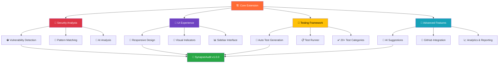

## ⚙ **Complete Technology Stack**

```mermaid
graph LR
    subgraph "🖥️ Frontend Layer"
        A[VS Code Extension API] --> B[TypeScript 4.7+]
        B --> C[Webview HTML/CSS/JS]
        C --> D[Responsive Design]
        D --> E[Mobile-First UI]
    end
    
    subgraph "🔄 Communication Layer"
        F[VS Code Commands] --> G[HTTP API Calls]
        G --> H[JSON Data Exchange]
        H --> I[Real-time Updates]
    end
    
    subgraph "🐍 Backend Layer"
        J[Python 3.8+] --> K[FastAPI Framework]
        K --> L[Pydantic Models]
        L --> M[Async Processing]
    end
    
    subgraph "🧠 AI & Analysis"
        N[OpenAI GPT-4] --> O[Anthropic Claude]
        O --> P[Google Gemini]
        P --> Q[Local Ollama]
        Q --> R[Custom Prompts]
    end
    
    subgraph "🧪 Testing Stack"
        S[Mocha Framework] --> T[Chai Assertions]
        T --> U[Sinon Mocking]
        U --> V[20+ Test Categories]
    end
    
    subgraph "🔍 Security Analysis"
        W[Pattern Matching] --> X[AST Parsing]
        X --> Y[AI Detection]
        Y --> Z[Confidence Scoring]
    end
    
    E --> F
    I --> J
    M --> N
    R --> W
    V --> W
    
    style A fill:#007ACC,color:#fff
    style J fill:#3776AB,color:#fff
    style N fill:#FF6B35,color:#fff
    style S fill:#8A2BE2,color:#fff
    style W fill:#28A745,color:#fff
```

| 🎯 Component | 🛠️ Technology | 📊 Details |
|:-------------|:--------------|:-----------|
| **Frontend** | TypeScript, VS Code API | 2300+ lines, 25+ commands |
| **UI Design** | Responsive CSS, Mobile-First | Adaptive to all screen sizes |
| **Backend** | Python, FastAPI, Pydantic | Async API, Type-safe models |
| **AI Integration** | Multi-LLM Support | OpenAI, Anthropic, Google, Ollama |
| **Security Engine** | Pattern + AI Analysis | 50+ vulnerability types |
| **Testing** | Mocha, Chai, Sinon | 20+ categories, auto-generation |
| **GitHub Integration** | REST API, SARIF | Issues, advisories, workflows |
| **Documentation** | Markdown, Mermaid | Comprehensive guides |

## 🛠️ **Installation**

### **Option 1: Install VSIX (Ready Now!)**
1. **Download**: Get [`synapse-audit-1.5.0.vsix`](https://github.com/digidenone/SynapseAudit/releases/latest) (263KB)
2. **Install**: In VS Code, press `Ctrl+Shift+P` → "Extensions: Install from VSIX" → Select the file
3. **Start**: The extension will automatically start the backend server
4. **Use**: Press `Ctrl+Shift+S` in any code file to analyze!

### **Option 2: VS Code Marketplace** 
🚀 **Coming Soon** - Will be available for one-click install from the marketplace

### **System Requirements**
- VS Code 1.82.0 or higher
- Python 3.8+ (auto-detected and used by the extension)
- 2GB RAM recommended
- Windows, macOS, or Linux

### **First-Time Setup**
The extension handles everything automatically:
1. **Backend Setup**: Python dependencies install automatically
2. **Server Start**: Backend starts when you first use the extension  
3. **Health Check**: Extension verifies everything is working
4. **Ready to Use**: Start analyzing code immediately!

**No manual configuration needed** - SynapseAudit works out of the box!

### **Option 3: Build from Source (Advanced)**

For developers who want to build and package the extension themselves:

```bash
# Clone the repository
git clone https://github.com/digidenone/SynapseAudit.git
cd SynapseAudit

# Install npm dependencies
npm install

# Compile TypeScript to JavaScript
npm run compile

# Build and package the extension
npm run package

# Install the generated VSIX file
code --install-extension synapse-audit-1.5.0.vsix
```

Available npm scripts:
- `npm run compile` - Build TypeScript source code
- `npm run watch` - Build in watch mode for development
- `npm run package` - Create distributable VSIX package
- `npm run vscode:prepublish` - Prepare for VS Code publishing

**Note**: The `.github` folder is currently empty but will contain CI/CD workflows, issue templates, and security automation in future releases.

## ⚙️ **Configuration (Optional)**

SynapseAudit works perfectly with default settings, but you can customize it:

```json
{
  "synapseAudit.autoAnalyze": false,           // Auto-analyze on file save
  "synapseAudit.severityFilter": "all",        // Show: all, high, critical
  "synapseAudit.enableInlineDecorations": true, // Visual indicators in code
  "synapseAudit.backendUrl": "http://localhost:8000", // Backend server URL
  "synapseAudit.excludePatterns": [            // Files to skip
    "node_modules/**",
    "*.min.js",
    "dist/**"
  ],
  "synapseAudit.logging.enabled": true,        // Enable detailed logging
  "synapseAudit.logging.level": "info",        // Logging level: debug, info, warn, error
  "synapseAudit.keyboard.analyzeCurrentFile": "ctrl+shift+s", // Custom shortcut
  "synapseAudit.keyboard.analyzeWorkspace": "ctrl+shift+w",   // Custom shortcut
  "synapseAudit.keyboard.clearResults": "ctrl+shift+c"        // Custom shortcut
}
```

**Access Settings**: `Ctrl+,` then search "synapseAudit"

## 🛠️ **Troubleshooting**

### **Commands Not Found**
If you see "command not found" errors:
1. **Reload VS Code**: Press `Ctrl+Shift+P` → "Developer: Reload Window"
2. **Check Installation**: Ensure the extension is properly installed and enabled
3. **View Logs**: Run "SynapseAudit: Show Output Logs" to see detailed error information
4. **Manual Activation**: Try running any SynapseAudit command to trigger activation

### **Sidebar Not Showing**
If the SynapseAudit sidebar doesn't appear:
1. **Open Activity Bar**: Click the SynapseAudit shield icon in the left sidebar
2. **Manual Command**: Press `Ctrl+Shift+P` → "View: Focus on SynapseAudit View"
3. **Reset View**: Try `Ctrl+Shift+P` → "View: Reset View Locations"

### **Backend Connection Issues**
If analysis fails with connection errors:
1. **Check Logs**: Run "SynapseAudit: Show Output Logs" 
2. **Manual Start**: Try "SynapseAudit: Start Backend Server"
3. **Python Check**: Ensure Python 3.8+ is installed and accessible
4. **Port Conflicts**: Check if port 8000 is available

### **Enable Debug Logging**
For detailed troubleshooting information:
```json
{
  "synapseAudit.logging.enabled": true,
  "synapseAudit.logging.level": "debug"
}
```

Then use `Ctrl+Shift+P` → "SynapseAudit: Show Output Logs" to view detailed logs.

## �️ **Security & Privacy**

- ✅ **Local Analysis**: Your code never leaves your machine
- ✅ **No Telemetry**: No data collection or tracking
- ✅ **Private by Design**: Analysis happens entirely offline
- ✅ **Open Source**: Fully auditable and transparent
- ✅ **Secure Communication**: Encrypted localhost API calls

## 🏗️ **Architecture Overview**

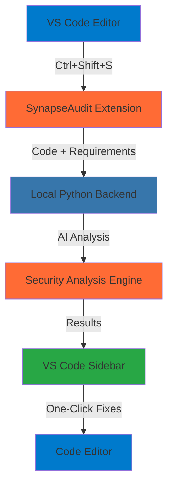

**Everything runs locally** - no external dependencies or cloud services required.

## 🚨 **Comprehensive Vulnerability Detection**

SynapseAudit detects 50+ security vulnerability patterns across 20+ languages with advanced AI analysis:

### **🔍 Multi-Layer Detection Engine**

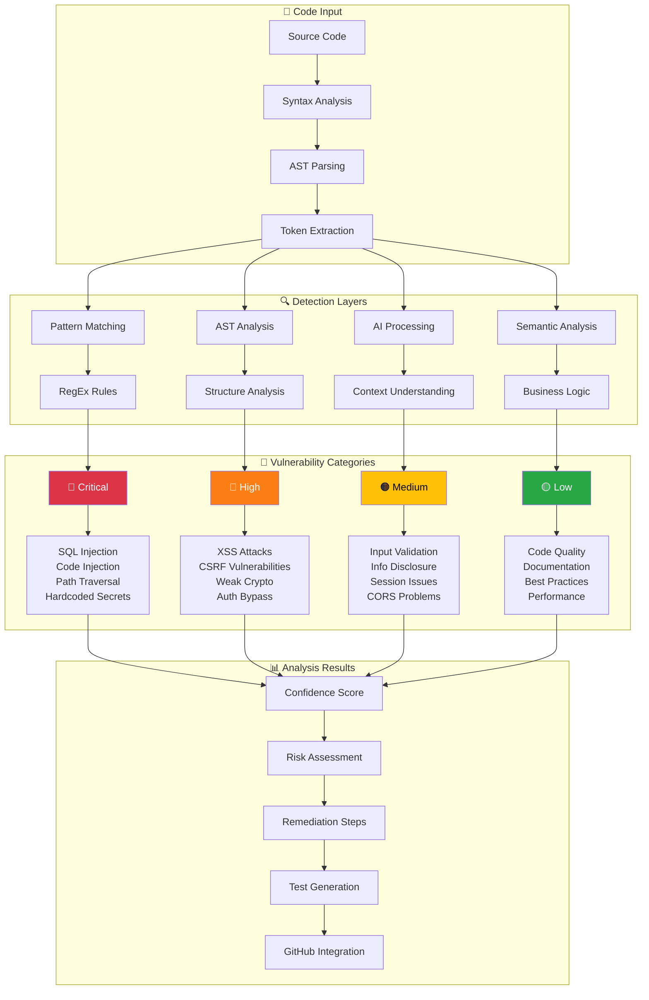

### **🛡️ Security Pattern Recognition**

```mermaid
mindmap
  root((🧠 AI Security Analysis))
    🚨 Injection Attacks
      SQL Injection
        String Concatenation
        Dynamic Queries
        NoSQL Injection
      Code Injection
        eval() Usage
        exec() Functions
        Template Injection
      Command Injection
        System Calls
        Shell Execution
        Process Spawning
    🔐 Authentication & Authorization
      Weak Passwords
        Hardcoded Credentials
        Default Passwords
        Weak Hashing
      Session Management
        Session Fixation
        Insecure Cookies
        Token Leakage
      Access Control
        Missing Authorization
        Privilege Escalation
        RBAC Issues
    🌐 Web Security
      XSS Vulnerabilities
        Reflected XSS
        Stored XSS
        DOM-based XSS
      CSRF Attacks
        Missing Tokens
        Weak Validation
        State Confusion
      CORS Issues
        Wildcard Origins
        Credential Exposure
        Header Injection
    🔒 Cryptography
      Weak Algorithms
        MD5 Usage
        SHA1 Implementation
        DES Encryption
      Poor Implementation
        Weak Random
        IV Reuse
        Key Management
```

### **Critical Vulnerabilities**
- 🚨 **SQL Injection** - Unsafe database queries and dynamic SQL construction
- 🚨 **Code Injection** - eval(), exec(), and similar dangerous functions  
- 🚨 **Path Traversal** - Directory traversal attacks and file system access
- 🚨 **Hardcoded Secrets** - API keys, passwords, tokens embedded in code

### **High Severity Issues**
- 🔴 **XSS (Cross-Site Scripting)** - innerHTML, document.write, and DOM manipulation
- 🔴 **CSRF Vulnerabilities** - Missing CSRF protection and state validation
- 🔴 **Insecure Cryptography** - MD5, SHA1, weak random number generation
- 🔴 **Authentication Bypass** - Timing attacks and logic vulnerabilities

### **Medium & Low Issues**
- 🟠 **Input Validation** - Missing sanitization and boundary checks
- 🟠 **Information Disclosure** - Debug information leaks and error exposure
- 🟡 **Code Quality** - Unused variables, complexity issues, maintainability
- 🟡 **Documentation** - Missing comments, unclear naming, architectural docs

### **Supported Languages**
JavaScript, TypeScript, Python, Java, PHP, C/C++, HTML, CSS, SQL, Go, Rust, Ruby, C#, Kotlin, Swift, Scala, Dart, Shell Scripts, YAML, JSON

## 🎯 **Example Analysis**

### **Input Code:**
```javascript
// vulnerable-example.js
function loginUser(username, password) {
    const apiKey = "sk-1234567890abcdef";
    const query = "SELECT * FROM users WHERE username = '" + username + "'";
    document.getElementById('welcome').innerHTML = 'Hello ' + username;
    return database.execute(query);
}
```

### **SynapseAudit Results:**
```
🧠 Analysis Complete - Found 3 critical issues

🚨 Critical Vulnerabilities (3)
├── 🔴 SQL Injection (Line 3)
│   ├── Risk: Database compromise, data theft
│   ├── Fix: Use parameterized queries
│   └── [🔧 Apply Fix] [� Add Test]
│
├── 🔴 Hardcoded API Key (Line 2) 
│   ├── Risk: API key exposure in source code
│   ├── Fix: Use environment variables
│   └── [🔧 Apply Fix] [� Add Test]
│
└── 🔴 XSS Vulnerability (Line 4)
    ├── Risk: Cross-site scripting attack
    ├── Fix: Use textContent instead of innerHTML
    └── [🔧 Apply Fix] [🧪 Add Test]

💡 AI Recommendations (3)
├── Implement input validation for username
├── Add comprehensive error handling
└── Use HTTPS for all API communications

⚡ Analysis completed in 1.2 seconds
```

## 📚 **Documentation & Support**

### **Complete Documentation**
- 📖 **[Installation Guide](INSTALLATION_GUIDE.md)** - Step-by-step setup instructions
- 🚀 **[Quick Start Guide](docs/QUICKSTART.md)** - Get running in 5 minutes
- ⚙️ **[Configuration Guide](docs/configuration.md)** - Advanced customization options
- 🔧 **[Troubleshooting Guide](docs/troubleshooting.md)** - Common issues and solutions
- 📊 **[Production Summary](PRODUCTION_READY_SUMMARY.md)** - Complete feature overview

### **Getting Help**
- 🐛 **[Report Issues](https://github.com/digidenone/SynapseAudit/issues)** - Bug reports and feature requests
- 💬 **[Discussions](https://github.com/digidenone/SynapseAudit/discussions)** - Community support
- 📧 **Email**: support@synapseaudit.com
- 📖 **[Wiki](https://github.com/digidenone/SynapseAudit/wiki)** - Extended documentation

### **For Developers**
- 🔧 **[Contributing Guide](CONTRIBUTING.md)** - How to contribute
- 🏗️ **[Architecture Docs](docs/architecture.md)** - Technical details
- 🧪 **[Testing Guide](docs/testing.md)** - Running and writing tests

## 👥 **Meet the Team**

SynapseAudit is built with ❤️ by a passionate team of security researchers and developers:

<table align="center">
  <tr>
    <td align="center">
      <a href="https://github.com/chiragnahata">
        
        <br />
        <sub><b>Chirag Nahata</b></sub>
      </a>
      <br />
      <sub>🧠 Project Lead & Core Developer</sub>
      <br />
      <sub>Extension Architecture, AI Integration</sub>
    </td>
    <td align="center">
      <a href="https://github.com/somyadipghosh">
        
        <br />
        <sub><b>Somyadip Ghosh</b></sub>
      </a>
      <br />
      <sub>🔒 Security Researcher</sub>
      <br />
      <sub>Vulnerability Patterns & Analysis</sub>
    </td>
    <td align="center">
      <a href="https://github.com/Shamonnoy">
        
        <br />
        <sub><b>Shamonnoy Halder</b></sub>
      </a>
      <br />
      <sub>🎨 UI/UX Developer</sub>
      <br />
      <sub>Frontend Design & User Experience</sub>
    </td>
    <td align="center">
      <a href="https://github.com/Rajarshi8">
        
        <br />
        <sub><b>Rajarashi Bhowmik</b></sub>
      </a>
      <br />
      <sub>⚙️ Backend Developer</sub>
      <br />
      <sub>API Development & Infrastructure</sub>
    </td>
  </tr>
  <tr>
    <td align="center">
      <a href="https://github.com/snigdhaghosh">
        
        <br />
        <sub><b>Snigdha Ghosh</b></sub>
      </a>
      <br />
      <sub>🔬 Research & Development</sub>
      <br />
      <sub>Algorithm Design & Machine Learning</sub>
    </td>
    <td align="center">
      <a href="https://github.com/ariyanbhattacharjee">
        
        <br />
        <sub><b>Ariyan Bhattarcharjee</b></sub>
      </a>
      <br />
      <sub>💻 Full Stack Developer</sub>
      <br />
      <sub>Integration & Platform Development</sub>
    </td>
    <td align="center">
      <a href="https://github.com/hiteshkumarroy">
        
        <br />
        <sub><b>Hitesh Kumar Roy</b></sub>
      </a>
      <br />
      <sub>🛡️ Security Engineer</sub>
      <br />
      <sub>Penetration Testing & Security Audits</sub>
    </td>
    <td align="center"></td>
  </tr>
</table>

<p align="center">
  <em>🚀 Built during HexaFalls Hackathon 2025 with dedication to making code security accessible to all developers</em>
</p>

## 🤝 Contributing

We welcome contributions! SynapseAudit is open source and community-driven.

### **Ways to Contribute**
- 🐛 Report bugs and issues
- 💡 Suggest new features
- 🔧 Submit code improvements
- 📝 Improve documentation
- 🧪 Add test cases
- 🌍 Translate to other languages

### **Development Setup**
```bash
# Clone the repository
git clone https://github.com/digidenone/SynapseAudit.git
cd SynapseAudit

# Install dependencies
npm install

# Build extension
npm run compile

# Test in VS Code
# Press F5 to launch Extension Development Host
```

See our [Contributing Guidelines](CONTRIBUTING.md) for detailed instructions.

## 📄 License

This project is licensed under the **MIT License** - see the [LICENSE](LICENSE) file for details.

**You are free to:**
- ✅ Use commercially
- ✅ Modify and distribute
- ✅ Use in private projects
- ✅ Include in your applications

## 🔗 Links & Resources

### **Downloads & Releases**
- 📦 **[Latest Release](https://github.com/digidenone/SynapseAudit/releases/latest)** - Download VSIX file
- 🏪 **[VS Code Marketplace](https://marketplace.visualstudio.com/items?itemName=Digidenone.synapse-audit)** - One-click install
- 🚀 **[Product Hunt](https://www.producthunt.com/products/synapseaudit)** - Featured security tool
- 🌐 **[Official Website](https://synapseaudit.vercel.app/)** - Documentation and demos
- 📋 **[Release Notes](https://github.com/digidenone/SynapseAudit/releases)** - Version history

## 🤝 Support & Community

- **� Website**: [https://synapseaudit.vercel.app/](https://synapseaudit.vercel.app/)
- **📦 VS Code Marketplace**: [https://marketplace.visualstudio.com/items?itemName=Digidenone.synapse-audit](https://marketplace.visualstudio.com/items?itemName=Digidenone.synapse-audit)
- **🚀 Product Hunt**: [https://www.producthunt.com/products/synapseaudit](https://www.producthunt.com/products/synapseaudit)
- **� Peerlist**: [https://peerlist.io/chiragnahata/project/synapseaudit](https://peerlist.io/chiragnahata/project/synapseaudit)
- **🐛 Issues**: [Report bugs](https://github.com/digidenone/SynapseAudit/issues)
- **💬 Discussions**: [Community forum](https://github.com/digidenone/SynapseAudit/discussions)
- **📞 Phone**: +917439611385
- **📧 Email**: digidenone@gmail.com
- **📖 Documentation**: [Full guides](https://github.com/digidenone/SynapseAudit/wiki)

### **Development & Community**  
- 🏠 **[GitHub Repository](https://github.com/digidenone/SynapseAudit)** - Source code
- 🐛 **[Issue Tracker](https://github.com/digidenone/SynapseAudit/issues)** - Report bugs
- 💬 **[Discussions](https://github.com/digidenone/SynapseAudit/discussions)** - Community forum
- � **[Peerlist Project](https://peerlist.io/chiragnahata/project/synapseaudit)** - Project showcase
- �📖 **[Documentation Wiki](https://github.com/digidenone/SynapseAudit/wiki)** - Extended docs

### **Social & Updates**
- 🐦 **[Twitter](https://twitter.com/synapseaudit)** - Updates and announcements
- 💼 **[LinkedIn](https://linkedin.com/company/synapseaudit)** - Professional updates
- 📧 **Newsletter** - Subscribe for security tips and updates

---

<p align="center">
  
  
  
</p>

<p align="center">
  <strong>🔐 Secure your code before it ships. Deploy with confidence.</strong><br>
  <em>Made with ❤️ by developers for developers</em>
</p>

---

**🚀 Ready to secure your code?** 

**[Download SynapseAudit](https://github.com/digidenone/SynapseAudit/releases/latest)** and start analyzing your code in minutes!

---

<p align="center">
  <strong>⭐ If you find SynapseAudit helpful, please give us a star on GitHub!</strong><br>
  <a href="https://github.com/digidenone/SynapseAudit">🌟 Star SynapseAudit</a>
</p>
