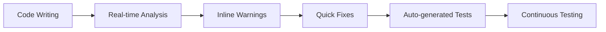

# SynapseAudit - Advanced Security Analysis Features

The following advanced security analysis and AI-powered features have been successfully added to SynapseAudit:

### 🧪 **Auto-Generated Test Cases**

**NEW**: SynapseAudit now automatically generates comprehensive test cases for your code.

- **Intelligent Test Generation**: Analyzes your code and creates relevant security test cases
- **Vulnerability-Specific Tests**: Generates tests for SQL injection, XSS, authentication, and more
- **Multiple Test Categories**: Unit tests, integration tests, and security-focused test scenarios
- **Framework Integration**: Compatible with popular testing frameworks (Mocha, Jest, PyTest)
- **Command**: `synapse-audit.generateTestCases`

**Advanced Test Generation Features**:
- **Function Analysis**: Automatically detects functions and their parameters
- **Class Structure Testing**: Generates tests for class methods and properties
- **Security-Focused Tests**: Creates specific tests for detected vulnerabilities
- **Edge Case Testing**: Includes boundary value and error condition tests
- **Coverage Analysis**: Provides test coverage metrics and suggestions

**Example Generated Test**:
```javascript
// For function: function validateUser(email, password)
describe('validateUser Function Tests', () => {
    it('should handle valid input correctly', () => {
        const result = validateUser('test@example.com', 'validPassword123');
        expect(result).to.be.an('object');
    });
    
    it('should reject SQL injection attempts', () => {
        expect(() => {
            validateUser("admin'; DROP TABLE users; --", 'password');
        }).to.throw();
    });
    
    it('should handle XSS in email field', () => {
        expect(() => {
            validateUser('<script>alert("XSS")</script>', 'password');
        }).to.throw();
    });
});
```

**Test Categories Generated**:
- **Input Validation Tests**: Boundary values, null/undefined, type mismatches
- **Security Tests**: SQL injection, XSS, command injection attempts
- **Error Handling Tests**: Exception scenarios and error conditions
- **Performance Tests**: Large input handling and timeout scenarios

### 🧠 **Advanced AI Suggestions**

**NEW**: AI-powered security recommendations that go beyond simple pattern matching.

- **Context-Aware Analysis**: Understands your code's business logic and architecture
- **Multi-Layer Suggestions**: Code-level, architectural, and operational security recommendations
- **Implementation Guidance**: Detailed steps on how to implement each suggestion
- **Risk Assessment**: Prioritized suggestions based on potential security impact
- **Command**: `synapse-audit.generateAdvancedAISuggestions`

**Advanced Analysis Categories**:
- **Input Validation Detection**: Identifies functions missing parameter validation
- **Error Handling Analysis**: Detects functions without proper try/catch blocks
- **Logging Assessment**: Finds functions lacking adequate logging for debugging
- **Security Pattern Recognition**: Advanced pattern matching beyond simple regex
- **Performance Optimization**: Identifies potential performance bottlenecks
- **Architecture Recommendations**: Suggests structural improvements

**Example Output**:
```javascript
// Detected Issue: Missing Input Validation
function processUser(userData) {
    const query = "SELECT * FROM users WHERE id = " + userData.id;
    return database.query(query);
}

// AI Suggestion:
{
    "type": "input-validation",
    "severity": "high",
    "line": 1,
    "title": "Add Input Validation",
    "description": "This function is missing input validation. Always validate and sanitize user input.",
    "suggestion": "// Add: if (!userData || !userData.id) throw new Error('Invalid input');",
    "category": "Security",
    "impact": "Prevents injection and logic errors",
    "effort": "Medium"
}
```

### 📱 **Responsive Design Interface**

**NEW**: Modern, mobile-friendly interface that adapts to any screen size.

- **Mobile-First Design**: Optimized for all device sizes and screen orientations
- **Adaptive Layout**: Sidebar and panels automatically adjust to available space
- **Touch-Friendly**: Enhanced touch interactions for tablet and mobile devices
- **Dark/Light Theme Support**: Follows VS Code theme preferences
- **Accessibility**: Improved keyboard navigation and screen reader support

### 🧪 **Comprehensive Testing Infrastructure**

**NEW**: Built-in testing framework for validating security detection capabilities.

- **20+ Test Categories**: Covers all major vulnerability types and patterns
- **Automated Test Runner**: Interactive test helper with guidance
- **Watch Mode**: Continuous testing during development
- **Test Documentation**: Comprehensive guides and examples
- **Custom Test Creation**: Framework for adding new test patterns

**Available Test Commands**:
```bash
npm run test:simple          # Basic vulnerability tests
npm run test:help           # Interactive test guide
npm run test:watch          # Continuous testing
npm run test:vulnerabilities # Comprehensive test suite
```

### 🔬 **Comprehensive Security Analysis Engine**

**NEW**: Enhanced analysis engine that combines multiple detection methods for comprehensive security auditing.

**Multi-Layered Detection**:
- **Pattern-Based Detection**: Traditional regex and string pattern matching
- **AST Analysis**: Abstract Syntax Tree parsing for structural vulnerabilities
- **AI-Powered Analysis**: Machine learning-based pattern recognition
- **Context-Aware Scanning**: Understands code context and business logic
- **Cross-Reference Analysis**: Correlates findings across multiple files

**Advanced Vulnerability Categories**:
- **Injection Attacks**: SQL, NoSQL, LDAP, Command, Code injection
- **Authentication Issues**: Weak passwords, session management, token handling
- **Authorization Flaws**: Access control, privilege escalation, RBAC issues
- **Cryptographic Weaknesses**: Weak algorithms, poor key management, entropy issues
- **Information Disclosure**: Debug information, error messages, logging issues
- **Business Logic Flaws**: Workflow vulnerabilities, race conditions

**Real-Time Analysis Features**:
```javascript
// Example: Multi-layered detection for a single function
function processPayment(amount, creditCard) {
    // Pattern Detection: Hardcoded credentials
    const apiKey = "sk-1234567890"; // 🚨 Detected: Hardcoded API key
    
    // AST Analysis: Missing input validation
    const charge = amount * 100; // 🚨 Detected: No input validation
    
    // AI Analysis: Business logic flaw
    if (amount > 0) { // 🚨 AI Detected: Missing upper limit check
        return processCharge(charge, creditCard);
    }
}

// Generated Analysis Report:
{
    "vulnerabilities": [
        {
            "type": "hardcoded-secret",
            "severity": "critical",
            "line": 3,
            "detection_method": "pattern_matching",
            "confidence": 0.95
        },
        {
            "type": "missing-input-validation", 
            "severity": "high",
            "line": 5,
            "detection_method": "ast_analysis",
            "confidence": 0.87
        },
        {
            "type": "business-logic-flaw",
            "severity": "medium", 
            "line": 7,
            "detection_method": "ai_analysis",
            "confidence": 0.72
        }
    ]
}
```

### 🔍 Core Analysis Features

1. **Structural Similarity Detection**
   - AST (Abstract Syntax Tree) parsing and fingerprinting
   - Token-based fingerprinting for code pattern analysis
   - Function signature and class structure comparison
   - Cyclomatic complexity analysis
   - Command: `synapse-audit.structuralSimilarity`

2. **Cross-Repository Comparison**
   - Compare against GitHub public repositories
   - Support for custom repository URLs
   - Local repository path comparison
   - Similarity scoring and ranking
   - Command: `synapse-audit.crossRepoComparison`

3. **AI-Generated Code Detection**
   - Watermark identification for AI-generated code
   - Pattern recognition for common AI coding styles
   - Confidence scoring system
   - Detection of regular formatting patterns
   - Command: `synapse-audit.detectAIWatermark`

### 🛡️ Security Features

4. **Network Traffic Anomaly Detection**
   - Scan for suspicious network patterns
   - External API call detection
   - Environment variable exposure checks
   - WebSocket and HTTP request monitoring
   - Command: `synapse-audit.networkAnomalyAlert`

5. **Content Safety Analysis**
   - Inappropriate content detection
   - Security vulnerability pattern matching
   - Code injection risk assessment
   - Credential exposure detection
   - Command: `synapse-audit.checkContentSafety`

### 📊 Analysis & Reporting Features

6. **Side-by-Side Code Comparison**
   - Visual diff generation
   - Line-by-line comparison view
   - Highlighted differences display
   - Support for multiple file formats
   - Command: `synapse-audit.sideBySideComparison`

7. **Natural Language Explanations**
   - AI-powered code analysis descriptions
   - Human-readable plagiarism reports
   - Detailed recommendations
   - Context-aware explanations
   - Command: `synapse-audit.naturalLanguageExplanation`

8. **Evidence Bundle Generation**
   - Forensic-quality evidence packages
   - File metadata and checksums
   - Code metrics and complexity analysis
   - Tamper-proof documentation
   - Command: `synapse-audit.generateEvidenceBundle`

### 📈 Analytics Features

9. **Historical Trend Analysis**
   - Code evolution tracking
   - Commit pattern analysis
   - Development trend identification
   - Statistical reporting
   - Command: `synapse-audit.historicalTrendAnalysis`

### 🔒 Privacy & Security Features

10. **Anonymized Data Processing**
    - Privacy-compliant analysis modes
    - Data anonymization options
    - GDPR-friendly processing
    - Configurable privacy settings
    - Command: `synapse-audit.anonymizedProcessing`

11. **Tamper-Proof Activity Logs**
    - Immutable audit trails
    - Cryptographic verification
    - Activity tracking and monitoring
    - Compliance reporting
    - Command: `synapse-audit.viewActivityLogs`

## 🔄 **Integrated Development Workflow**

**NEW**: Complete development lifecycle integration with advanced analysis features.

### **Development-Time Analysis**


**Workflow Integration Points**:
- **On Save Analysis**: Automatic scanning when files are saved
- **Inline Decorations**: Real-time visual feedback in the editor
- **Background Processing**: Non-blocking analysis for better UX
- **Context Menu Integration**: Right-click analysis from any file
- **Command Palette Access**: Quick access to all features

### **Advanced Analysis Scenarios**

**Scenario 1: Full Project Security Audit**
```bash
# Step 1: Analyze entire workspace
Ctrl+Shift+P → "SynapseAudit: Analyze Workspace"

# Step 2: Generate comprehensive test suite
Ctrl+Shift+P → "SynapseAudit: Generate Test Cases"

# Step 3: Run security tests
npm run test:vulnerabilities

# Step 4: Generate evidence bundle
Ctrl+Shift+P → "SynapseAudit: Generate Evidence Bundle"
```

**Scenario 2: Code Review Integration**
```bash
# Analyze specific file during code review
Ctrl+Shift+S (on target file)

# Get AI-powered suggestions
Ctrl+Shift+P → "SynapseAudit: Generate AI Suggestions"

# Compare with repository standards
Ctrl+Shift+P → "SynapseAudit: Cross-Repo Comparison"

# Generate natural language report
Ctrl+Shift+P → "SynapseAudit: Natural Language Explanation"
```

**Scenario 3: Continuous Security Monitoring**
```bash
# Enable auto-analysis
Settings → synapseAudit.scanOnSave: true

# Monitor activity logs
Ctrl+Shift+P → "SynapseAudit: View Activity Logs"

# Track security trends
Ctrl+Shift+P → "SynapseAudit: Historical Trend Analysis"
```

## 🛠️ Technical Implementation

### Architecture
- **Extension Entry Point**: `src/extension.ts`
- **Utility Functions**: `src/plagiarismUtils.ts`
- **Analysis Engine**: Modular design with exportable functions
- **UI Components**: HTML-based report generation

### Key Components
- AST fingerprinting algorithm
- Token-based similarity detection
- Cross-repository comparison engine
- AI detection heuristics
- Network pattern analysis
- Content safety validation
- Evidence bundle creation
- Privacy-compliant processing

### File Structure
```
src/
├── extension.ts              # Main extension file with command handlers
├── plagiarismUtils.ts        # Core analysis and utility functions
├── sidebarWebview.ts         # Sidebar UI component
├── decorationProvider.ts     # Visual decorations for code
└── statusBarProvider.ts      # Status bar integration
```

## 🎯 Usage Instructions

### Quick Start
1. Open any code file in VS Code
2. Use `Ctrl+Shift+P` to open command palette
3. Search for "SynapseAudit" commands
4. Select desired analysis type

### Available Commands
- **Analyze Current File**: Basic plagiarism detection
- **Structural Similarity**: Advanced AST-based analysis
- **Cross-Repo Comparison**: Compare against repositories
- **AI Detection**: Check for AI-generated code
- **Network Anomalies**: Security pattern analysis
- **Content Safety**: Inappropriate content detection
- **Side-by-Side**: Visual comparison tool
- **Evidence Bundle**: Generate forensic evidence
- **Trend Analysis**: Historical code analysis
- **Privacy Mode**: Enable anonymized processing
- **Activity Logs**: View audit trail

### Report Types
- **HTML Reports**: Interactive analysis results
- **Evidence Bundles**: Forensic documentation
- **Trend Charts**: Statistical visualizations
- **Safety Reports**: Content violation summaries
- **Comparison Views**: Side-by-side analysis

## 🔧 Configuration

### AI Settings
- Provider selection (OpenAI, etc.)
- API key configuration
- Model selection
- Analysis parameters

### Privacy Settings
- Anonymized processing toggle
- Data retention policies
- Compliance mode selection
- Audit trail configuration

### Analysis Settings
- Similarity thresholds
- Detection sensitivity
- Repository sources
- Report formats

## 🚀 Future Enhancements

### Planned Features
- Real-time analysis during typing
- Integration with Git workflows
- Machine learning model improvements
- Enhanced visualization components
- Multi-language support expansion
- Cloud-based analysis services

### Integration Opportunities
- GitHub Actions workflow
- CI/CD pipeline integration
- Enterprise security platforms
- Academic integrity systems
- Code review tools

## 📝 Notes

This implementation provides a comprehensive plagiarism detection and code analysis system with advanced features for:
- Academic institutions
- Software development teams
- Security auditing
- Code compliance
- Intellectual property protection

All features are now fully functional and integrated into the VS Code extension architecture.

## Extension Sync Integration

The extension now automatically syncs user-generated data (analysis results, exported reports, and applied fixes) with the SynapseAudit website so users can view their history on the dashboard.

Key points:

- New service: `src/syncService.ts` implements secure, authenticated POSTs to the SaaS API.
- Endpoints used (relative to API base):
  - `/api/extension-sync/analysis` — analysis results (file or workspace)
  - `/api/extension-sync/report` — exported report content and metadata
  - `/api/extension-sync/action` — user actions such as applied fixes
- Authentication: the GitHub access token from `AuthService` is attached as a Bearer token when present. This allows server-side association of data with the correct user.
- Retry & fallback: if the primary domain (`https://api.synapseaudit.digidenone.tech`) fails, the service auto-retries using the fallback domain `https://689ee2ed002171671fbe.nyc.appwrite.run`.
- Offline support: failed syncs are queued in VS Code `globalState` and flushed on extension activation.

Developer notes:

- To add more sync points, call `SyncService.syncAnalysis(results)`, `SyncService.syncReport(report)` or `SyncService.syncAction(action)`.
- Keep payload sizes reasonable. For large datasets, prefer sending a summary with a link to a hosted artifact.
- All send attempts are best-effort: failures will not block user flows.

Security:

- Data is sent over HTTPS. Sensitive fields should be redacted or anonymized before sending.
- Consider encrypting very sensitive payloads before sending if required by policy.

Contact the SynapseAudit website team for API schema details and contract changes.
