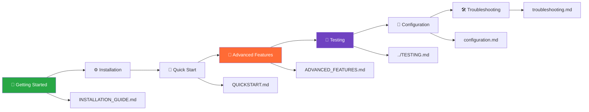
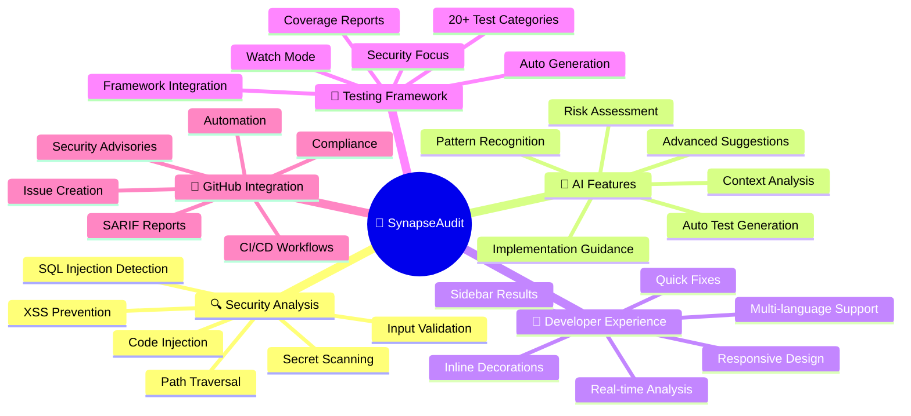
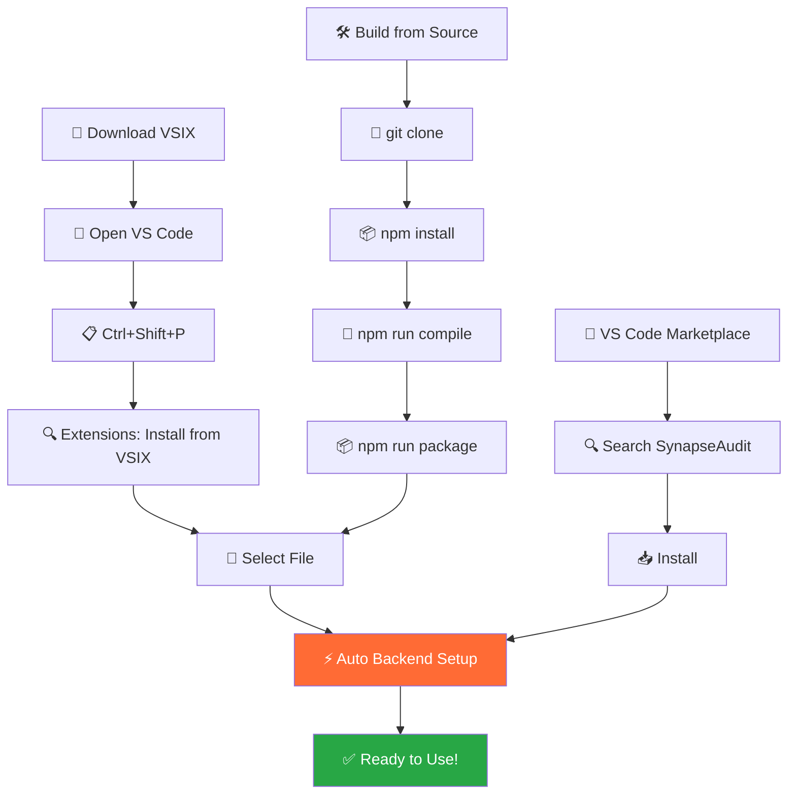
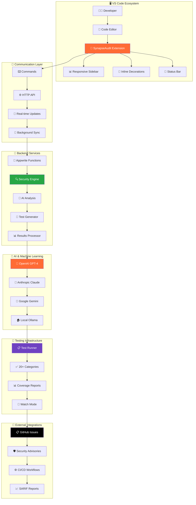
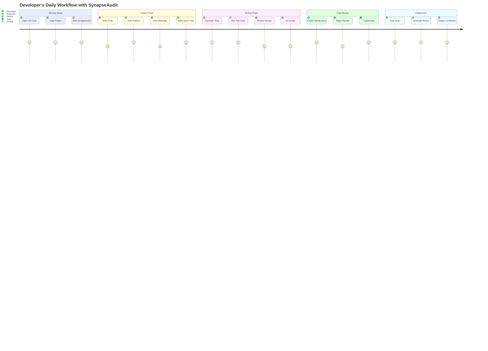

# 🧠 SynapseAudit - AI-Powered Security Code Analysis

[](https://github.com/chiragnahata/SynapseAudit-Website)
[](LICENSE)
[](https://code.visualstudio.com/)
[](TESTING.md)
[](ADVANCED_FEATURES.md)

**SynapseAudit** is a powerful VS Code extension that analyzes your code for security vulnerabilities, requirement gaps, and provides AI-powered recommendations. It supports 20+ programming languages and integrates seamlessly into your development workflow with real-time two-way sync to the SaaS dashboard.

## 🚀 **Quick Navigation**



## ✨ **Complete Feature Overview**



### 🔍 **Real-time Security Analysis**
- **🚨 SQL Injection Detection**: Identifies dangerous query patterns and dynamic SQL construction
- **🚨 XSS Vulnerability Scanning**: Detects cross-site scripting risks in web applications  
- **🚨 Hardcoded Secrets Detection**: Finds exposed passwords, API keys, and authentication tokens
- **🚨 Input Validation Checking**: Ensures proper data sanitization and boundary validation
- **🚨 Code Injection Prevention**: Identifies eval(), exec(), and similar dangerous functions
- **🚨 Path Traversal Protection**: Prevents directory traversal and file system attacks
- **🚨 50+ Security Patterns**: Comprehensive vulnerability detection across 8 attack categories

### 🧠 **AI-Powered Insights** 🆕
- **Multi-LLM Support**: Integrated with OpenAI GPT-4, Google Gemini, Anthropic Claude, and local Ollama models
- **Bring Your Own AI (BYOAI)**: Connect custom AI endpoints and models for privacy and control
- **Synapse Cortex Engine**: Our proprietary AI engine for advanced pattern recognition and analysis
- **Auto-Generated Test Cases**: 🆕 Automatically creates comprehensive security test cases for your code
- **Advanced AI Suggestions**: 🆕 Context-aware recommendations beyond pattern matching
- **Requirement Gap Analysis**: Compares code against specified requirements and standards
- **Smart Recommendations**: AI-generated code improvement suggestions with implementation details
- **Context-Aware Analysis**: Understands your project's architecture and business logic
- **Risk Assessment**: Prioritized vulnerabilities based on potential security impact
- **Intelligent Fallback System**: Automatic provider switching with graceful degradation

### 🎯 **Developer-Friendly Integration**
- **Multi-Platform Support**: Available as VS Code extension with SaaS dashboard, web app, PWA, and Chrome extension
- **Real-Time Two-Way Sync**: Automatic synchronization between extension and cloud dashboard
- **Professional SaaS Dashboard**: Full-featured web dashboard with comprehensive security analytics
- **Responsive Design**: 🆕 Modern, mobile-friendly interface that adapts to any screen size
- **Inline Decorations**: Visual indicators directly in your code (like spelling errors)
- **Sidebar Panel**: Comprehensive results with actionable fixes and detailed explanations
- **One-Click Fixes**: Apply suggested improvements instantly with automatic code updates
- **Keyboard Shortcuts**: Quick analysis with `Ctrl+Shift+S` (fully customizable)
- **Testing Infrastructure**: 🆕 Built-in test runner with 50+ vulnerability test categories
- **Background Processing**: Non-blocking analysis for optimal development experience

### 🚀 **Supported Languages & Frameworks**
JavaScript, TypeScript, Python, Java, PHP, C/C++, HTML, CSS, SQL, Go, Rust, Ruby, C#, Kotlin, Swift, Scala, Dart, Shell Scripts, YAML, JSON, and more (50+ languages supported)

## 📦 Installation

### **🚀 Quick Installation Flow**



### Method 1: From VS Code Marketplace (Recommended)
1. Open VS Code
2. Go to Extensions (`Ctrl+Shift+X`)
3. Search for "SynapseAudit"
4. Click "Install"

### Method 2: Install from VSIX
1. Download the latest `.vsix` file from [Releases](https://github.com/digidenone/SynapseAudit/releases)
2. Open VS Code
3. Press `Ctrl+Shift+P` and type "Extensions: Install from VSIX"
4. Select the downloaded `.vsix` file

### Method 3: Build from Source
```bash
git clone https://github.com/digidenone/SynapseAudit.git
cd SynapseAudit
npm install
npm run compile
npm run package
code --install-extension synapse-audit-2.0.0.vsix
```

## 🏗️ **System Architecture Overview**



## 🎯 **Development Workflow Integration**



## 🚀 Quick Start

### 1. Install and Authenticate
1. Install SynapseAudit from VS Code Marketplace
2. Extension prompts for GitHub authentication
3. Sign in with GitHub to connect to SaaS platform
4. Extension automatically syncs with your dashboard

### 2. Analyze Your Code
- Open any code file
- Press `Ctrl+Shift+S` or use Command Palette → "SynapseAudit: Analyze Current File"
- View results in the SynapseAudit sidebar
- Results automatically sync to your dashboard

## 🎮 Usage

### Command Palette Commands
- `SynapseAudit: Analyze Current File` - Analyze the active file
- `SynapseAudit: Analyze Workspace` - Analyze all files in workspace
- `SynapseAudit: Clear Results` - Clear analysis results
- `SynapseAudit: Export Report` - Export security report
- `SynapseAudit: Start Backend Server` - Start the analysis backend
- `SynapseAudit: Stop Backend Server` - Stop the backend server

### Context Menu Integration
- Right-click in any code file → "SynapseAudit: Analyze Current File"
- Right-click in Explorer → Analyze specific files

### Keyboard Shortcuts
- `Ctrl+Shift+S` (Windows/Linux) / `Cmd+Shift+S` (Mac) - Analyze current file

## ⚙️ Configuration

Configure SynapseAudit through VS Code settings:

```json
{
  "synapseAudit.enableSync": true,
  "synapseAudit.autoAnalyze": false,
  "synapseAudit.severityFilter": "all",
  "synapseAudit.enableInlineDecorations": true,
  "synapseAudit.aiProvider": "openai",
  "synapseAudit.excludePatterns": [
    "node_modules/**",
    "*.min.js",
    "dist/**"
  ]
}
```

### Settings Explained

| Setting | Description | Default |
|---------|-------------|---------|
| `enableSync` | Enable two-way sync with dashboard | `true` |
| `autoAnalyze` | Automatically analyze files on save | `false` |
| `severityFilter` | Minimum severity level to display | `all` |
| `enableInlineDecorations` | Show vulnerability indicators in code | `true` |
| `aiProvider` | Preferred AI provider (openai, claude, gemini, ollama) | `openai` |
| `excludePatterns` | File patterns to exclude from analysis | `["node_modules/**", "*.min.js", "dist/**"]` |

## 📊 Understanding Results

### Vulnerability Severity Levels
- 🚨 **Critical**: Immediate security risk requiring urgent attention
- 🔴 **High**: Significant security vulnerability
- 🟠 **Medium**: Moderate security concern
- 🟡 **Low**: Minor security improvement

### Result Categories

#### 🔐 Security Vulnerabilities
- **SQL Injection**: Database query vulnerabilities
- **XSS**: Cross-site scripting risks
- **Hardcoded Secrets**: Exposed credentials
- **Input Validation**: Missing input sanitization

#### 📋 Requirement Gaps
- **Missing Validations**: Required checks not implemented
- **Incomplete Features**: Functionality gaps
- **Security Compliance**: Standards not met

#### 💡 AI Recommendations
- **Code Quality**: Improvement suggestions
- **Performance**: Optimization opportunities
- **Documentation**: Missing comments and docs
- **Best Practices**: Industry standard recommendations

## 🔧 Backend Setup

SynapseAudit uses a cloud-based SaaS architecture with Appwrite Functions for serverless backend processing. No local backend installation required.

### System Requirements
- VS Code 1.82.0+
- GitHub account for authentication
- Internet connection for cloud sync and AI features
- Network access to Appwrite Cloud

### Authentication Setup
1. Install the extension
2. Sign in with GitHub when prompted
3. Extension automatically connects to SaaS platform
4. Data syncs in real-time between extension and dashboard

## 🎯 Example Analysis

### Input Code (JavaScript)
```javascript
// Vulnerable code example
function loginUser(username, password) {
    const query = "SELECT * FROM users WHERE username = '" + username + "'";
    const apiKey = "sk-1234567890abcdef";
    document.getElementById('welcome').innerHTML = "Hello " + username;
    return database.execute(query);
}
```

### SynapseAudit Results
```
🚨 Critical Vulnerabilities (2)
├── SQL Injection (Line 2)
│   └── Fix: Use parameterized queries
└── Hardcoded API Key (Line 3)
    └── Fix: Use environment variables

🟠 Medium Vulnerabilities (1)
└── XSS via innerHTML (Line 4)
    └── Fix: Use textContent instead

💡 AI Recommendations (3)
├── Add input validation for username/password
├── Implement proper error handling
└── Add JSDoc documentation
```

## 🛡️ Security & Privacy

- **Local Analysis**: Code analysis happens locally on your machine
- **Secure Cloud Sync**: Encrypted data transmission to Appwrite Cloud
- **User Isolation**: All data is scoped to authenticated GitHub user
- **No Code Storage**: Source code is not permanently stored in cloud
- **Encrypted Communication**: All API calls use HTTPS with secure tokens
- **Privacy Controls**: User consent required for data synchronization

## 🔍 Troubleshooting

### Common Issues

**Authentication Failed**
```
Error: GitHub authentication required
```
**Solution**: Sign in with GitHub using the extension's authentication flow

**Sync Connection Failed**
```
Error: Unable to sync with dashboard
```
**Solution**: Check internet connection and try "SynapseAudit: Sync with Dashboard Now"

**Analysis Timeout**
```
Error: Analysis request timed out
```
**Solution**: Check if the file is too large (>100KB limit) or network connectivity

**No Results Displayed**
```
Analysis completed but no vulnerabilities found
```
**Solution**: This is normal for secure code! Try analyzing a test file with known vulnerabilities.

### Getting Help

1. **Check Logs**: Open Output panel → "SynapseAudit" channel
2. **Restart Extension**: Reload VS Code window (`Ctrl+Shift+P` → "Developer: Reload Window")
3. **Report Issues**: [GitHub Issues](https://github.com/chiragnahata/SynapseAudit-Website/issues)
4. **Documentation**: [Full Documentation](https://github.com/chiragnahata/SynapseAudit-Website)

## 🤝 Contributing

We welcome contributions! See [CONTRIBUTING.md](CONTRIBUTING.md) for guidelines.

### Development Setup
```bash
git clone https://github.com/yourusername/synapseaudit.git
cd synapseaudit
npm install
npm run compile
code .
```

Press `F5` to launch the Extension Development Host for testing.

## 📄 License

This project is licensed under the MIT License - see the [LICENSE](LICENSE) file for details.

## 🙏 Acknowledgments

- Built with VS Code Extension API
- Powered by FastAPI backend
- AI analysis with advanced pattern matching
- Security patterns inspired by OWASP guidelines

## 📞 Support

- 📧 Email: digidenone@gmail.com
- 🐛 Issues: [GitHub Issues](https://github.com/chiragnahata/SynapseAudit-Website/issues)
- 💬 Discussions: [GitHub Discussions](https://github.com/chiragnahata/SynapseAudit-Website/discussions)
- 📖 Documentation: [Full Documentation](https://github.com/chiragnahata/SynapseAudit-Website)
- 🌐 Website: [https://synapseaudit.digidenone.tech/](https://synapseaudit.digidenone.tech/)

---

**Made with ❤️ for developers by developers**

*Secure your code before it ships. Deploy with confidence.*
