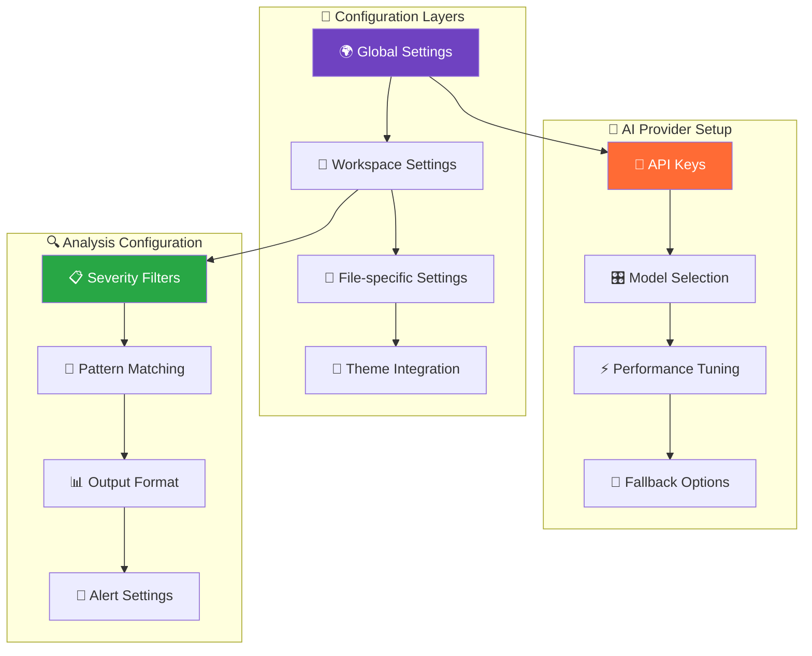

# ⚙️ Configuration Guide - SynapseAudit

Complete guide to configuring SynapseAudit for your development workflow.

## 🎯 **Configuration Overview**



## ⚙️ VS Code Settings

Configure SynapseAudit through VS Code settings (`Ctrl+,` then search "synapseAudit"):

### Basic Configuration

```json
{
  "synapseAudit.enableSync": true,
  "synapseAudit.autoAnalyze": false,
  "synapseAudit.severityFilter": "all",
  "synapseAudit.enableInlineDecorations": true,
  "synapseAudit.aiProvider": "openai",
  "synapseAudit.excludePatterns": [
    "node_modules/**",
    "*.min.js",
    "dist/**",
    "build/**",
    "coverage/**"
  ]
}
```

## 📝 Settings Reference

### `synapseAudit.enableSync`
- **Type**: `boolean`
- **Default**: `true`
- **Description**: Enable two-way synchronization with the SaaS dashboard

**Examples:**
```json
// Enable dashboard sync
"synapseAudit.enableSync": true

// Disable sync (local-only mode)
"synapseAudit.enableSync": false
```

### `synapseAudit.autoAnalyze`
- **Type**: `boolean`
- **Default**: `false`
- **Description**: Automatically analyze files when saved

**Usage:**
```json
// Enable auto-analysis on file save
"synapseAudit.autoAnalyze": true

// Disable auto-analysis (manual only)
"synapseAudit.autoAnalyze": false
```

### `synapseAudit.severityFilter`
- **Type**: `string`
- **Options**: `"all"`, `"high"`, `"critical"`
- **Default**: `"all"`
- **Description**: Minimum severity level to display

**Examples:**
```json
// Show all vulnerabilities
"synapseAudit.severityFilter": "all"

// Show only high and critical
"synapseAudit.severityFilter": "high"

// Show only critical vulnerabilities
"synapseAudit.severityFilter": "critical"
```

### `synapseAudit.enableInlineDecorations`
- **Type**: `boolean`
- **Default**: `true`
- **Description**: Show vulnerability indicators inline in code

**Visual Impact:**
- `true`: Shows colored underlines and icons in code
- `false`: Results only in sidebar panel

### `synapseAudit.aiProvider`
- **Type**: `string`
- **Options**: `"openai"`, `"claude"`, `"gemini"`, `"ollama"`
- **Default**: `"openai"`
- **Description**: Preferred AI provider for enhanced analysis

### `synapseAudit.excludePatterns`
- **Type**: `array[string]`
- **Default**: `["node_modules/**", "*.min.js", "dist/**"]`
- **Description**: File patterns to exclude from analysis

**Common Patterns:**
```json
"synapseAudit.excludePatterns": [
  "node_modules/**",        // npm packages
  "*.min.js",              // minified JavaScript
  "*.min.css",             // minified CSS
  "dist/**",               // distribution files
  "build/**",              // build output
  "coverage/**",           // test coverage
  "vendor/**",             // third-party code
  "*.generated.*",         // generated files
  "test/**/*.spec.js",     // test files
  ".git/**"                // git metadata
]
```

## 🎨 Customizing Visual Appearance

### Severity Colors
You can customize the colors used for different severity levels by modifying your VS Code theme or using the workbench color customizations:

```json
"workbench.colorCustomizations": {
  "synapseAudit.critical": "#ff0000",
  "synapseAudit.high": "#ff6600", 
  "synapseAudit.medium": "#ffaa00",
  "synapseAudit.low": "#ffff00"
}
```

### Icon Themes
SynapseAudit uses these icons in the sidebar:
- 🚨 Critical vulnerabilities
- 🔴 High severity
- 🟠 Medium severity
- 🟡 Low severity
- 💡 AI recommendations

## 🏢 Team & Workspace Configuration

### Shared Team Settings
Create `.vscode/settings.json` in your project root:

```json
{
  "synapseAudit.autoAnalyze": true,
  "synapseAudit.severityFilter": "high",
  "synapseAudit.excludePatterns": [
    "node_modules/**",
    "dist/**",
    "*.test.js",
    "coverage/**"
  ]
}
```

### Language-Specific Configuration
Configure analysis for specific file types:

```json
"synapseAudit.languageConfig": {
  "javascript": {
    "enableSQLInjectionCheck": true,
    "enableXSSCheck": true,
    "enableSecretDetection": true
  },
  "python": {
    "enableSQLInjectionCheck": true,
    "enableSecretDetection": true,
    "enableImportCheck": true
  },
  "typescript": {
    "enableTypeCheck": true,
    "enableSecretDetection": true
  }
}
```

## 🔐 Security Configuration

### SaaS Platform Security
SynapseAudit uses enterprise-grade security with Clerk authentication:

```json
{
  "synapseAudit.enableWebAuthn": true,
  "synapseAudit.requireTwoFactor": false,
  "synapseAudit.sessionTimeout": 3600000,
  "synapseAudit.dataEncryption": true
}
```

### Data Privacy Settings
Control what data is sent for analysis:

```json
{
  "synapseAudit.anonymizeCode": true,
  "synapseAudit.excludeComments": true,
  "synapseAudit.hashFilenames": true,
  "synapseAudit.telemetryOptIn": false
}
```

## 🚀 Performance Optimization

### Large Codebases
For better performance with large projects:

```json
{
  "synapseAudit.maxFileSize": 50000,
  "synapseAudit.parallelAnalysis": 4,
  "synapseAudit.cacheResults": true,
  "synapseAudit.incrementalAnalysis": true
}
```

### Memory Management
```json
{
  "synapseAudit.memoryLimit": "512MB",
  "synapseAudit.batchSize": 10,
  "synapseAudit.gcInterval": 100
}
```

## 🔄 CI/CD Integration

### GitHub Actions
```yaml
# .github/workflows/security-audit.yml
name: Security Audit
on: [push, pull_request]

jobs:
  security-audit:
    runs-on: ubuntu-latest
    steps:
      - uses: actions/checkout@v2
      - name: Setup Node.js
        uses: actions/setup-node@v2
        with:
          node-version: '18'
      - name: Install SynapseAudit CLI
        run: npm install -g synapseaudit-cli
      - name: Run Security Audit
        run: synapseaudit-cli analyze --config .synapseaudit.json
        env:
          SYNAPSE_AUDIT_TOKEN: ${{ secrets.SYNAPSE_AUDIT_TOKEN }}
```

### Configuration File (.synapseaudit.json)
```json
{
  "version": "2.0",
  "analysis": {
    "severityThreshold": "medium",
    "excludePatterns": ["test/**", "docs/**"],
    "includeLanguages": ["javascript", "python", "typescript"]
  },
  "reporting": {
    "format": "sarif",
    "outputFile": "security-report.sarif",
    "uploadToGitHub": true
  },
  "sync": {
    "enableDashboardSync": true,
    "projectName": "${{ github.repository }}"
  }
}
```

## 🛠️ Advanced Configuration

### Custom Rules
Create custom vulnerability detection rules:

```json
{
  "synapseAudit.customRules": [
    {
      "name": "Custom SQL Injection",
      "pattern": "execute\\(.*\\+.*\\)",
      "severity": "high",
      "message": "Potential SQL injection via string concatenation"
    },
    {
      "name": "Debug Code",
      "pattern": "console\\.log|debugger",
      "severity": "low", 
      "message": "Remove debug code before production"
    }
  ]
}
```

### API Rate Limiting
```json
{
  "synapseAudit.rateLimiting": {
    "requestsPerMinute": 60,
    "burstLimit": 10,
    "retryDelay": 1000
  }
}
```

## 🔍 Debugging Configuration

Enable debug logging:
```json
{
  "synapseAudit.debug": true,
  "synapseAudit.logLevel": "verbose",
  "synapseAudit.logFile": ".synapseaudit.log"
}
```

View logs:
1. Open Output panel (`Ctrl+Shift+U`)
2. Select "SynapseAudit" from dropdown
3. Check for configuration errors or API issues

## 📋 Configuration Templates

### Frontend Development
```json
{
  "synapseAudit.autoAnalyze": true,
  "synapseAudit.severityFilter": "all",
  "synapseAudit.excludePatterns": [
    "node_modules/**",
    "dist/**",
    "*.min.*",
    "coverage/**"
  ],
  "synapseAudit.languageFocus": ["javascript", "typescript", "html", "css"]
}
```

### Backend Development
```json
{
  "synapseAudit.autoAnalyze": false,
  "synapseAudit.severityFilter": "high",
  "synapseAudit.excludePatterns": [
    "venv/**",
    "__pycache__/**",
    "*.pyc",
    "migrations/**"
  ],
  "synapseAudit.languageFocus": ["python", "sql", "yaml"]
}
```

### Security-Critical Projects
```json
{
  "synapseAudit.autoAnalyze": true,
  "synapseAudit.severityFilter": "all",
  "synapseAudit.enableAllChecks": true,
  "synapseAudit.strictMode": true,
  "synapseAudit.requireReview": true
}
```

---

**Need help?** Check our [troubleshooting guide](troubleshooting.md) or [open an issue](https://github.com/chiragnahata/SynapseAudit-Website/issues).
