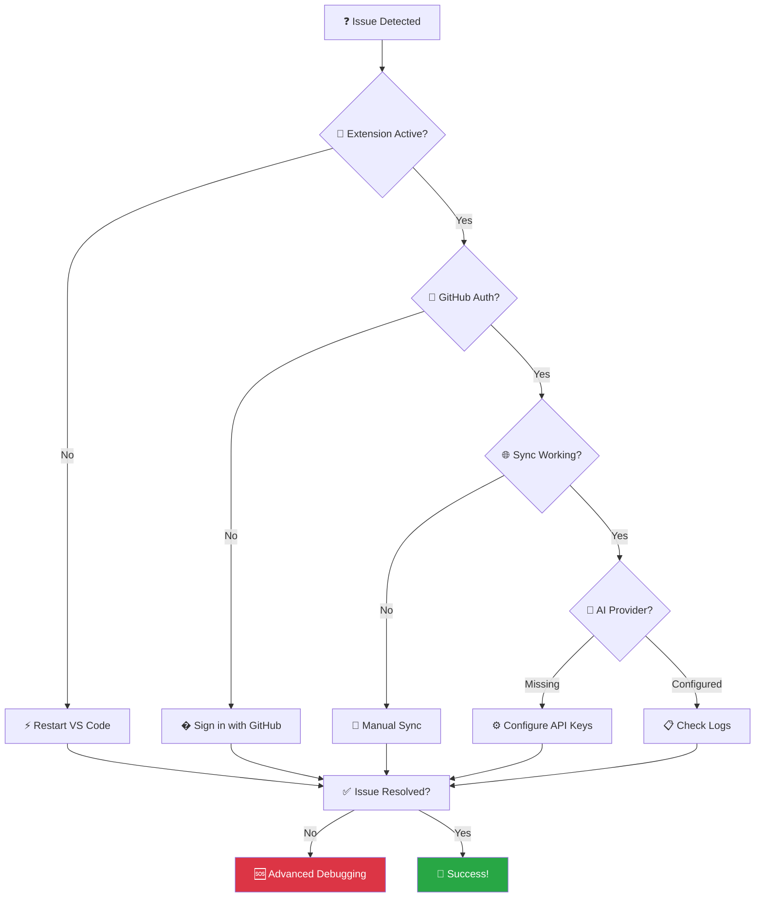
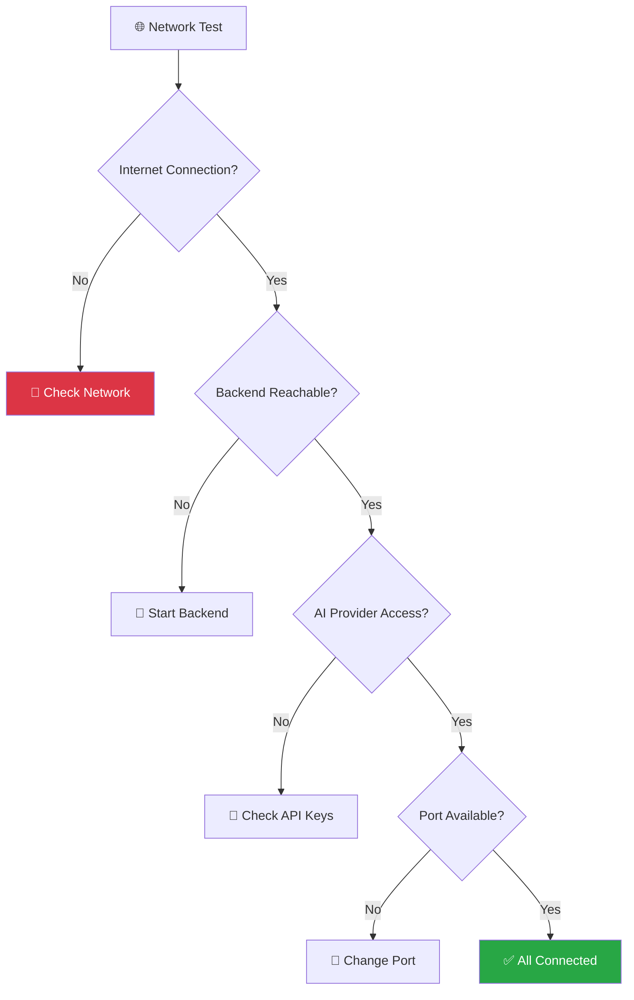
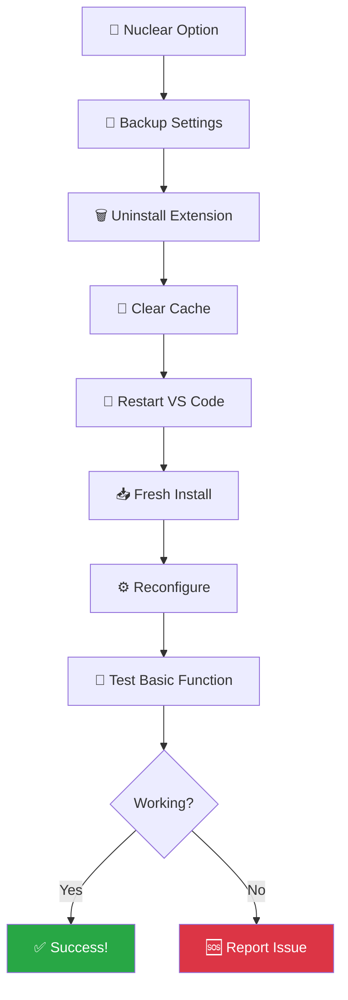

# 🛠️ SynapseAudit - Advanced Troubleshooting Guide

## 🚨 **Quick Diagnosis Flow**



## 🚨 **Most Common Issues & Quick Fixes**

### 1. **Extension Commands Not Found** ⚠️

**Symptoms:**
- VS Code shows "command not found" when trying to run SynapseAudit commands
- Commands don't appear in Command Palette (`Ctrl+Shift+P`)
- Keyboard shortcuts (`Ctrl+Shift+S`) don't work

**Quick Fix:**
```
1. Ctrl+Shift+P → "Developer: Reload Window"
2. Wait 30 seconds for extension to fully load
3. Try Ctrl+Shift+S again
```

**If still not working:**
1. **Check Extension Status**
   - Go to Extensions panel (`Ctrl+Shift+X`)
   - Search for "SynapseAudit"
   - Ensure it's installed and enabled (green checkmark)

2. **Force Activation**
   ```
   Ctrl+Shift+P → "SynapseAudit: Show Welcome Guide"
   ```

3. **View Logs for Errors**
   ```
   Ctrl+Shift+P → "SynapseAudit: Show Output Logs"
   ```

### 2. **Sidebar Not Visible** 📋

**Symptoms:**
- SynapseAudit sidebar panel doesn't appear
- Can't see analysis results
- Shield icon missing from Activity Bar

**Quick Fix:**
1. **Look for Shield Icon** 🛡️ in the left Activity Bar
2. Click it to open SynapseAudit panel
3. If missing, try:
   ```
   Ctrl+Shift+P → "View: Focus on SynapseAudit View"
   ```

**Alternative Solutions:**
```
# Reset view layout
Ctrl+Shift+P → "View: Reset View Locations"

# Force show extension
Ctrl+Shift+P → "View: Show Extension"
```

### 3. **Authentication Issues** �

**Symptoms:**
- "GitHub authentication required" errors
- Can't access SaaS features
- Sync fails with auth errors

**Quick Fix:**
1. **Sign In Again**
   ```
   Ctrl+Shift+P → "SynapseAudit: Sign In"
   ```
2. **Clear Browser Cache** if sign-in page doesn't load
3. **Check GitHub Permissions** - ensure extension has access to email

### 4. **Sync Connection Failures** 🔄

**Symptoms:**
- "Failed to sync with dashboard" errors
- Results don't appear in web dashboard
- Offline queue not processing

**Quick Fix:**
1. **Manual Sync**
   ```
   Ctrl+Shift+P → "SynapseAudit: Sync with Dashboard Now"
   ```
2. **Check Internet Connection**
3. **View Pending Items**
   ```
   Ctrl+Shift+P → "SynapseAudit: View Sync Status"
   ```
    
    VS->>Ext: User Action
    Ext->>Back: Health Check
    
    alt Backend Running
        Back-->>Ext: ✅ Healthy
        Ext->>Back: Analysis Request
        Back->>AI: Process Code
        AI-->>Back: Results
        Back-->>Ext: Analysis Complete
        Ext-->>VS: Show Results
    else Backend Down
        Back-->>Ext: ❌ No Response
        Ext->>Ext: Auto-Start Backend
        Ext->>Back: Retry Health Check
        alt Start Success
            Back-->>Ext: ✅ Now Running
        else Start Failed
            Ext-->>VS: ⚠️ Error Message
        end
    end
```

**Alternative backend start methods:**
- VS Code Command: `Ctrl+Shift+P` → "SynapseAudit: Start Backend Server"
- Terminal: `cd backend && python start.py`
- Check backend logs in terminal for errors

#### Error: "Port 8000 already in use"

**Solution 1: Kill existing process**
```bash
# Windows
netstat -ano | findstr 8000
taskkill /PID <PID_NUMBER> /F

# macOS/Linux
lsof -ti:8000 | xargs kill -9
```

**Solution 2: Change port**
1. Open VS Code Settings (`Ctrl+,`)
2. Search "synapseAudit.backendUrl"
3. Change to `http://localhost:8001`
4. Update backend to use port 8001

---

### 2. Python & Dependencies Issues

#### Error: "Python not found" or "pip not found"

**Symptoms:**
- Backend fails to start
- Module import errors
- Python command not recognized

**Solutions:**

**Install Python 3.8+:**
- Download from [python.org](https://python.org)
- During installation, check "Add Python to PATH"
- Restart VS Code after installation

**Verify installation:**
```bash
python --version
pip --version
```

**Fix PATH issues (Windows):**
1. Search "Environment Variables" in Windows
2. Edit System Environment Variables
3. Add Python installation path to PATH
4. Restart VS Code

#### Error: "Module not found" (FastAPI, pydantic, etc.)

**Solution:**
```bash
cd backend
pip install -r requirements.txt

# If pip install fails, try:
python -m pip install --upgrade pip
pip install -r requirements.txt --force-reinstall
```

---

### 3. Analysis Issues

#### No vulnerabilities found (when they should exist)

**Possible causes:**
1. **Code doesn't match patterns**: Try with test vulnerable code
2. **Severity filter**: Check if filter is hiding results
3. **Language not supported**: Verify file extension

**Test with known vulnerable code:**
```javascript
// test-vuln.js
function unsafeQuery(input) {
    const sql = "SELECT * FROM users WHERE id = " + input;
    const password = "admin123";
    document.innerHTML = userInput;
    return execute(sql);
}
```

**Check settings:**
```json
{
  "synapseAudit.severityFilter": "all",  // Show all severities
  "synapseAudit.enableInlineDecorations": true
}
```

#### Analysis timeout errors

**Symptoms:**
- Long analysis times
- Timeout error messages
- Incomplete results

**Solutions:**

**Check file size:**
- Maximum file size: 100KB
- Large files may timeout
- Split large files for analysis

**Increase timeout:**
```json
{
  "synapseAudit.timeoutMs": 60000  // 60 seconds
}
```

**Check backend performance:**
```bash
# Monitor backend logs
cd backend
python start.py  # Check console output
```

---

### 4. VS Code Extension Issues

#### Extension not loading

**Symptoms:**
- SynapseAudit doesn't appear in sidebar
- Commands not available in palette
- No extension activation

**Solutions:**

**Reload VS Code:**
- `Ctrl+Shift+P` → "Developer: Reload Window"

**Check extension installation:**
1. Go to Extensions (`Ctrl+Shift+X`)
2. Search "SynapseAudit"
3. Verify it's installed and enabled

**Check VS Code version:**
- Minimum required: VS Code 1.82.0
- Update if necessary

**Clear extension cache:**
```bash
# Close VS Code, then delete cache
rm -rf ~/.vscode/extensions/.obsolete
```

#### Commands not working

**Symptoms:**
- Keyboard shortcuts don't work
- Command palette entries missing
- Context menu items missing

**Solutions:**

**Reset keybindings:**
1. `Ctrl+Shift+P` → "Preferences: Open Keyboard Shortcuts"
2. Search "synapse-audit"
3. Reset to default: `Ctrl+Shift+S`

**Reload extension:**
```bash
# In VS Code
Ctrl+Shift+P → "Developer: Reload Window"
```

---

### 5. Inline Decorations Issues

#### No colored underlines or icons in code

**Check settings:**
```json
{
  "synapseAudit.enableInlineDecorations": true
}
```

**Theme compatibility:**
- Some themes may hide decorations
- Try with default VS Code theme
- Check theme-specific settings

**Clear and reapply:**
- `Ctrl+Shift+P` → "SynapseAudit: Clear Results"
- Re-run analysis

---

### 6. Performance Issues

#### Slow analysis performance

**Symptoms:**
- Long wait times
- VS Code becomes unresponsive
- High CPU/memory usage

**Solutions:**

**Exclude large directories:**
```json
{
  "synapseAudit.excludePatterns": [
    "node_modules/**",
    "dist/**",
    "build/**",
    "coverage/**",
    ".git/**",
    "*.min.js"
  ]
}
```

**Disable auto-analysis:**
```json
{
  "synapseAudit.autoAnalyze": false
}
```

**Analyze smaller files:**
- Focus on specific files
- Avoid analyzing entire workspace
- Use file size limits

---

## 🔍 Diagnostic Tools

### 1. Check Extension Logs

**View logs:**
1. Open Output panel (`Ctrl+Shift+U`)
2. Select "SynapseAudit" from dropdown
3. Review error messages and warnings

### 2. Backend Health Check

**Test backend manually:**
```bash
curl http://localhost:8000/health
```

**Expected response:**
```json
{
  "status": "healthy",
  "service": "SynapseAudit API",
  "version": "1.0.0"
}
```

### 3. Network Diagnostics

### **🌐 Network Connection Flow**



**Test API connection:**
```bash
# Test health endpoint
curl -v http://localhost:8000/health

# Test with actual analysis
curl -X POST http://localhost:8000/audit \
  -H "Content-Type: application/json" \
  -d '{"code":"test","language":"javascript","filename":"test.js","requirements":""}'
```

### 4. Configuration Validation

**Check current configuration:**
1. `Ctrl+Shift+P` → "Preferences: Open Settings (JSON)"
2. Search for "synapseAudit" entries
3. Verify correct syntax and values

---

## 🚨 Emergency Fixes

### **🔄 Complete Reset Workflow**



### Complete Reset

If all else fails, perform a complete reset:

1. **Uninstall extension:**
   - Extensions panel → SynapseAudit → Uninstall

2. **Clear cache:**
   ```bash
   # Close VS Code first
   rm -rf ~/.vscode/extensions/synapseaudit.*
   ```

3. **Reset settings:**
   - Remove all `synapseAudit.*` entries from settings

4. **Reinstall:**
   - Fresh installation from marketplace
   - Reconfigure with minimal settings

### Factory Reset Settings

```json
{
  "synapseAudit.backendUrl": "http://localhost:8000",
  "synapseAudit.autoAnalyze": false,
  "synapseAudit.severityFilter": "all",
  "synapseAudit.enableInlineDecorations": true,
  "synapseAudit.excludePatterns": [
    "node_modules/**",
    "*.min.js",
    "dist/**"
  ]
}
```

---

## 🆘 Getting Additional Help

### Before Reporting Issues

1. **Update everything:**
   - VS Code to latest version
   - SynapseAudit extension to latest
   - Python to 3.8+

2. **Try minimal reproduction:**
   - Fresh workspace
   - Simple test file
   - Default settings

3. **Collect diagnostics:**
   - Extension logs
   - Backend logs
   - System information

### Reporting Bugs

When opening an issue, include:

**System Information:**
- OS and version
- VS Code version
- Python version
- Extension version

**Reproduction Steps:**
1. Step-by-step instructions
2. Expected vs actual behavior
3. Error messages (exact text)

**Logs:**
- Extension logs from Output panel
- Backend console output
- Any relevant screenshots

### Community Support

- 🐛 [GitHub Issues](https://github.com/yourusername/synapseaudit/issues)
- 💬 [GitHub Discussions](https://github.com/yourusername/synapseaudit/discussions)
- 📧 Email: support@synapseaudit.com
- 📖 [Documentation Wiki](https://github.com/yourusername/synapseaudit/wiki)

---

**Still having issues?** Don't hesitate to [open an issue](https://github.com/yourusername/synapseaudit/issues) - we're here to help!
